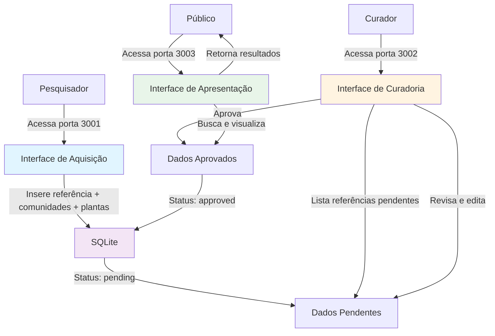
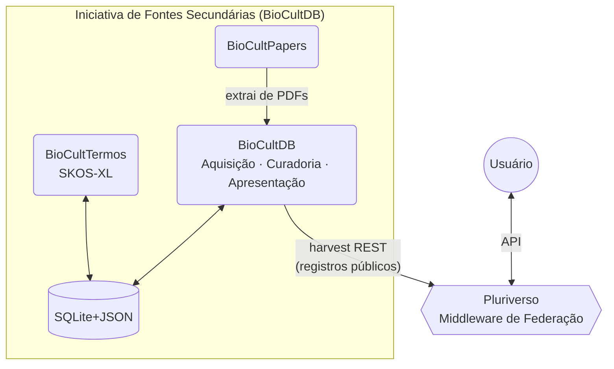

# BioCultDB - Base de Dados Etnobotânica
## Versão 1.0

<div align="center">
  


  [](https://github.com/edalcin/BioCultDB/releases)
  [](https://doi.org/10.5281/zenodo.18139413)
</div>

Sistema web para gerenciamento de **dados secundários** etnobotânicos sobre a relação entre comunidades tradicionais e plantas, extraídos de artigos científicos publicados.

> "Se os dados não estão fisicamente sob o controle de quem os gerou, a soberania é apenas uma promessa bonita em um termo de consentimento."
>
> — Eduardo Dalcin, em [*Sementes Livres, Solos Próprios: Por que o Conhecimento Tradicional exige uma Arquitetura Federada*](https://eduardo.dalc.in/por-que-o-conhecimento-tradicional-exige-uma-arquitetura-federada/), post que resume e ilustra didaticamente a arquitetura federada da qual o BioCultDB é o membro de referência para fontes secundárias.

## O que é Etnobotânica?

A etnobotânica é uma disciplina que investiga as interações e relações complexas entre as plantas e as pessoas ao longo do tempo e do espaço. Ela abrange o conhecimento tradicional e ocidental, incluindo os diversos usos (alimentares, medicinais, entre outros), a cosmovisão, os sistemas de gestão e classificação, e as línguas que as diferentes culturas mantêm em relação às plantas e aos seus ecossistemas terrestres e aquáticos associados. Em essência, busca compreender como as sociedades percebem, utilizam, manejam e atribuem significado cultural as plantas, atuando como uma ponte fundamental entre a biologia e as ciências humanas.

> Prance, G.T. Ethnobotany, the science of survival: a declaration from Kaua'i. *Econ Bot* **61**, 1–2 (2007). https://doi.org/10.1007/BF02862367

## Sobre o Projeto

O **BioCultDB** é uma interface baseada na web para um banco de dados SQLite (JSON1) que centraliza **dados secundários** sobre conhecimento tradicional de comunidades brasileiras em relação ao uso de plantas.

### O que são Dados Secundários?

**Dados secundários** são informações que já foram coletadas, publicadas e estão disponíveis em fontes existentes, como artigos científicos, livros, relatórios e outras publicações. Diferentemente dos dados primários (coletados diretamente pelo pesquisador através de entrevistas, observações ou experimentos), os dados secundários representam a compilação e sistematização de conhecimentos já documentados na literatura científica.

No contexto do BioCultDB:
- **Fonte**: Artigos científicos publicados em periódicos revisados por pares
- **Conteúdo**: Relações documentadas entre comunidades tradicionais e plantas (usos, nomes vernaculares, conhecimentos associados)
- **Evidência**: Cada registro no banco de dados está vinculado à sua publicação científica original (referência bibliográfica completa com autores, ano, título, DOI)

Essa abordagem permite:
- Reunir conhecimento disperso em múltiplas publicações
- Facilitar buscas e análises integradas de dados etnobotânicos
- Preservar a rastreabilidade das informações até suas fontes originais
- Respeitar os direitos autorais e a ética na pesquisa com comunidades tradicionais

## Arquitetura

O projeto segue a arquitetura proposta em [Arquitetura BioCultural](https://github.com/edalcin/Arquitetura-BioCultural), organizada em três contextos principais:

### 1. **Aquisição** (Entrada de Dados Secundários)
Interface dedicada à entrada de **dados secundários extraídos de artigos científicos publicados**.

**Porta**: 3001
**Funcionalidade**: Formulário hierárquico para entrada de:
- Referência bibliográfica completa (título, autores, ano, resumo, DOI)
- Comunidades tradicionais documentadas no artigo
  - O sistema suporta a classificação de comunidades tradicionais em 29 categorias, conforme o **[Decreto Nº 8.750, de 9 de maio 2016](https://www.planalto.gov.br/ccivil_03/_Ato2015-2018/2016/Decreto/D8750.htm)**, que regulamenta a Política Nacional de Desenvolvimento Sustentável dos Povos e Comunidades Tradicionais.

- Plantas e seus usos reportados para cada comunidade

**Importante**: Cada registro está sempre vinculado à sua publicação científica original, garantindo rastreabilidade e respeito aos direitos autorais.

### 2. **Curadoria** (Edição e Validação)
Interface especializada para controle de qualidade com acesso restrito a pesquisadores e representantes das comunidades.

**Porta**: 3002
**Funcionalidade**:
- Listagem de referências com status (pendente/aprovada/rejeitada)
- Edição de conteúdo (metadados, comunidades, plantas)
- Workflow de aprovação implementando princípios C.A.R.E. (Collective Benefit, Authority to Control, Responsibility, Ethics)
- **Justificativa de rejeição**: Campo obrigatório para documentar o motivo ao rejeitar uma referência, com exibição permanente do motivo e remoção automática ao alterar para outro status
- Validação taxonômica (planejada para implementação futura)

### 3. **Apresentação** (Busca e Visualização) - Home Page
Interface pública e padrão para disseminação dos dados curados, com apresentação aprimorada.

**Porta**: 3003 (Interface padrão)
**Funcionalidade**:
- Logo do projeto centralizado na home page
- Busca Google-like em todos os campos do documento
- Busca avançada por tipo de comunidade, nome da comunidade, planta (nome científico ou vernacular), estado e município
- Visualização de resultados em formato de cards responsivos
- Acesso aberto aos dados aprovados
- Exportação de dados em formatos abertos (planejado)

### 4. **Painel de Estatísticas** (Dashboard Analítico)
Interface visual interativa para exploração e análise dos dados etnobotânicos.

**Porta**: 3003 (Rota `/painel`)
**Funcionalidades**:
- **Cartões de Resumo**: Total de comunidades, referências aprovadas, plantas únicas e autores únicos
- **Mapas de Calor**: Distribuição geográfica de referências e comunidades por estado (GeoChart)
- **Gráficos Interativos**:
  - Evolução temporal de publicações por ano (gráfico de área)
  - Top 10 plantas mais citadas (gráfico de barras)
- **Tabelas Analíticas**:
  - Top 10 autores mais produtivos
  - Comunidades com maior número de plantas documentadas
  - Referências com mais comunidades estudadas
  - Referências com maior diversidade de plantas
- **Filtros Avançados**: Estado, tipo de comunidade e período de publicação
- **Tecnologia**: Google Charts + HTMX + Alpine.js

### 5. **etnoChat** (Interface Conversacional)
Interface de conversação com IA para interagir com o banco de dados em linguagem natural.

**Porta**: 3003 (Rota `/etnochat`)
**Funcionalidades**:
- Perguntas em linguagem natural sobre comunidades e plantas
- Sugestões de buscas e relacionamentos entre dados
- Explicações contextualizadas sobre os dados etnobotânicos

## Estrutura de Dados

O banco de dados utiliza uma estrutura hierárquica em JSON, conforme definido em [`/docs/referencia/dataStructure.json`](./docs/referencia/dataStructure.json):

```
Referência (Publicação Científica)
├── titulo
├── autores[]
├── ano
├── resumo
├── DOI
├── status (pending/approved/rejected)
└── comunidades[] (uma ou mais)
    ├── nome
    ├── tipo (Andirobeiras, Caiçaras, Quilombolas, etc.)
    ├── municipio
    ├── estado
    ├── local
    ├── atividadesEconomicas[]
    ├── observacoes
    └── plantas[] (uma ou mais)
        ├── nomeCientifico[]
        ├── nomeVernacular[]
        └── tipoUso[]
```


```json
{
  "titulo": "string",
  "autores": ["SOBRENOME, I.", ...],
  "ano": number,
  "resumo": "string em português",
  "DOI": "string | null",
  "fonte": "string",
  "comunidades": [
    {
      "nome": "string",
      "tipo": "string (da lista válida)",
      "municipio": "string | null",
      "estado": "string | null",
      "local": "string | null",
      "atividadesEconomicas": ["string", ...] | null,
      "observacoes": "string | null",
      "plantas": [
        {
          "nomeCientifico": ["Genus species", ...],
          "nomeVernacular": ["nome-comum", ...],
          "tipoUso": ["string", ...]
        }
      ]
    }
  ]
}
```

## Stack Tecnológica

- **Backend**: Node.js 20 LTS + Express.js
- **Frontend**: HTMX + Alpine.js + Tailwind CSS
- **Banco de Dados**: SQLite (better-sqlite3, JSON1)
- **Containerização**: Docker (Alpine Linux)
- **Template Engine**: EJS
- **Testes**: Jest (SQLite :memory:)

## Arquitetura Técnica

- **Tipo de Projeto**: Aplicação web com backend e frontend
- **Organização**: Três aplicações Express do BioCultDB (Aquisição/Curadoria/Apresentação, 3001-3003) em processos separados; na **unidade dual-app de produção**, mais dois processos do BioCultTermos (4000-4001) sobre o mesmo container e o mesmo arquivo SQLite — ver "Empacotamento por Unidade Federada" abaixo
- **Renderização**: Server-side rendering com HTMX para interatividade
- **Responsividade**: Design responsivo de 320px (mobile) a 1920px+ (desktop)

## Empacotamento por Unidade Federada (ADR-005)

Na Arquitetura BioCultural v3.2, o BioCultDB é o repositório "anfitrião" da **Unidade de Fontes
Secundárias**: um único container Docker que roda BioCultDB (3001-3003) **e** BioCultTermos
(4000-4001) sobre o **mesmo arquivo SQLite compartilhado** (`/data/biocultdb.sqlite`, ADR-005 da
[Arquitetura-BioCultural](https://github.com/edalcin/Arquitetura-BioCultural)). Sem MongoDB, sem
servidor de banco separado — soberania = arquivo único, portável, backup = copiar o arquivo.

BioCultTermos entra como **git submodule** em `./bioculttermos`. **Em produção desde julho de 2026**
(container Unraid `BioCultDB`, imagem `ghcr.io/edalcin/biocultdb:latest`) — histórico completo da
integração em [`integracao.md`](./integracao.md) e
[`docs/decisions/ADR-001-integracao-bioculttermos.md`](./docs/decisions/ADR-001-integracao-bioculttermos.md).

### Subir a unidade

```bash
# 1. Clonar com o submodule (ou inicializar depois, se já clonado)
git clone --recurse-submodules https://github.com/edalcin/BioCultDB.git
# ou, em um clone existente:
git submodule update --init --recursive

# 2. Subir o container único da unidade
docker compose -f docker/docker-compose.unidade.yml up --build
```

Isso builda `docker/Dockerfile.unidade` (multi-stage: compila Tailwind CSS + `better-sqlite3` de
ambos os apps; runtime `node:20-alpine` não-root) e sobe UM container com `docker/start-unit.sh`
(via `dumb-init`) iniciando os dois processos Node (BioCultDB e BioCultTermos) lado a lado. Ambos
abrem o mesmo arquivo via `SQLITE_DB_PATH=/data/biocultdb.sqlite` (volume nomeado `sqlite_data`,
persiste entre reinícios).

**BioCultTermos na unidade**: porta **4000** expõe o vocabulário público (sem autenticação);
porta **4001** expõe a curadoria de termos, protegida por HTTP Basic Auth
(`ADMIN_USERNAME`/`ADMIN_PASSWORD`), com busca por nome (sugestões enquanto digita) para relacionar
conceitos entre si. O `AcquisitionService` lê os registros gravados em `biocultdb_records` (via
BioCultDB), extrai valores de **4 campos monitorados** — tipo de comunidade, nome vernacular,
tipo de uso e atividade econômica — e cria conceitos SKOS-XL com `status: candidate`; nome
científico saiu do escopo de curadoria em 2026-08-10 (ver
[decisão](docs/curadoria/decisao-nomes-cientificos-fora-de-escopo.md));
também semeia um vocabulário estático de referência de tipos de uso (`docs/referencia/tipoUso.txt`, ~450
termos do domínio etnobotânico), cobrindo o vocabulário do domínio além do que já foi digitado em
algum registro. Um curador promove cada candidato a `active` pela interface 4001. A aquisição é
executada exclusivamente sob demanda: o curador clica em **"Executar Aquisição"** no dashboard admin
(porta 4001), que chama `POST /acquisition/run`.

**Status em produção**: corte realizado e validado — as 5 portas respondem, `biocultdb_records` e
`etnotermos*` coexistem no mesmo arquivo, e o vocabulário candidato já foi gerado a partir dos
dados publicados: **28 registros bibliográficos → 2536 conceitos candidatos** (844 nomes
científicos, 981 nomes vernaculares, 668 tipos de uso, 34 atividades econômicas, 9 tipos de
comunidade), aguardando curadoria.

### Unidade Comunidade Tradicional (mesmo padrão, ainda não materializado)

A segunda unidade da federação (`BioCultRelatos` + `BioCultTermos`, hoje `BioCultRelatos` é
greenfield/só documentação) seguirá o MESMO padrão quando `BioCultRelatos` existir: repo anfitrião
= `BioCultRelatos`, `BioCultTermos` como submodule, `Dockerfile.unidade` + `start-unit.sh` +
`docker-compose.unidade.yml` análogos (trocando as portas 3001-3003 do BioCultDB pela porta do
BioCultRelatos), um único container, um único arquivo SQLite compartilhado.

O mesmo padrão de empacotamento (container único + BioCultTermos embutido no mesmo arquivo SQLite) vale para os quatro tipos de membro da federação v3.2 — Fontes Secundárias (BioCultDB), Comunidade Tradicional (BioCultRelatos), Acervos Históricos/Museológicos (BioCultAcervos) e Obras de Naturalistas (BioCultNaturalistas). Em todos, a camada semântica é local e soberana; o Pluriverso a unifica via mapeamentos SKOS-XL entre os `ConceptScheme` de cada membro.

## Princípios C.A.R.E.

O projeto implementa os princípios C.A.R.E. para dados de povos indígenas e comunidades tradicionais:

- **C**ollective Benefit: Benefício coletivo para as comunidades
- **A**uthority to Control: Autoridade das comunidades sobre seus dados
- **R**esponsibility: Responsabilidade no uso dos dados
- **E**thics: Ética na coleta, armazenamento e disseminação

## Documentação Técnica

**Índice completo da documentação: [`docs/README.md`](./docs/README.md)** — todos os documentos de
`docs/`, organizados por propósito, com uma descrição de cada um.

Atalhos para os mais consultados:

- **Instalação e Desenvolvimento**: [`INSTALLATION.md`](./INSTALLATION.md)
- **Manual de Curadoria (SKOS-XL)**: [edalcin.github.io/BioCultTermos](https://edalcin.github.io/BioCultTermos/) (site publicado; ponteiro local em [`docs/curadoria/Manual.md`](./docs/curadoria/Manual.md))
- **Especificação de Requisitos**: [`docs/decisions/spec.md`](./docs/decisions/spec.md)
- **Modelo de Dados**: [`docs/decisions/data-model.md`](./docs/decisions/data-model.md)
- **Integração com BioCultTermos**: [`docs/decisions/ADR-001-integracao-bioculttermos.md`](./docs/decisions/ADR-001-integracao-bioculttermos.md) (decisão) · [`integracao.md`](./integracao.md) (checklist executado e resultado) · [`docs/operacao/corte-producao-unidade.md`](./docs/operacao/corte-producao-unidade.md) (runbook de corte em produção) · [ADR-007 da Arquitetura BioCultural](https://github.com/edalcin/Arquitetura-BioCultural/blob/main/docs/architecture-decisions/ADR-007-shared-bioculttermos-module.md) (decisão arquitetural do módulo compartilhado entre as 4 unidades)
- **Contratos de API**: [`docs/decisions/contracts/`](./docs/decisions/contracts/)
- **Decisão de Stack Tecnológica**: [`docs/decisions/technology-decision.md`](./docs/decisions/technology-decision.md)
- **Arquitetura do etnoChat**: [`docs/decisions/etnochat-plan.md`](./docs/decisions/etnochat-plan.md)

## Workflow Completo



**Passos do workflow:**

1. **Pesquisador** acessa interface de **Aquisição** (porta 3001)
2. Insere dados da referência científica com comunidades e plantas
3. Dados salvos com status `pending`
4. **Curador** acessa interface de **Curadoria** (porta 3002)
5. Revisa e edita dados se necessário
6. Aprova ou rejeita referência (com justificativa obrigatória para rejeições)
7. **Público** acessa interface de **Apresentação** (porta 3003)
8. Busca e visualiza dados aprovados
9. Acessa **Painel de Estatísticas** (`/painel`) para análises visuais e exploratórias

## Segurança

- Sem autenticação por padrão (controle de acesso gerenciado em nível de rede/infraestrutura)
- Validação server-side de todos os dados
- Sanitização de inputs para prevenir XSS e NoSQL injection
- Todas as interfaces em português

## Próximas Funcionalidades

- Validação taxonômica automática (APIs de Flora e Funga do Brasil, GBIF)
- Autenticação para curadoria e entrada de dados
- Histórico de alterações (audit trail)
- Exportação de dados (CSV, JSON)
- API REST para integrações externas
- Integração com APIs de periódicos científicos
- Conclusão do etnoChat com integração via MCP (Model Context Protocol)

## Projetos Relacionados

O BioCultDB faz parte de um ecossistema integrado de ferramentas para gestão de dados etnobotânicos:

### [Arquitetura BioCultural](https://github.com/edalcin/Arquitetura-BioCultural)
Projeto principal que define a arquitetura de referência para sistemas etnobotânicos. Estabelece os três contextos fundamentais (Aquisição, Curadoria, Apresentação) e os padrões de design implementados no BioCultDB.

### [BioCultPapers](https://github.com/edalcin/BioCultPapers)
Sistema de aquisição automatizada de dados secundários com auxílio de Inteligência Artificial. Permite a extração e inclusão de novos registros na base de dados do BioCultDB a partir de artigos científicos de forma assistida por IA, agilizando o processo de entrada de dados.

### [BioCultTermos](https://github.com/edalcin/BioCultTermos) 🆕 v2.0
Sistema de curadoria de vocabulário controlado etnobotânico sob o padrão **[SKOS-XL](https://www.w3.org/TR/skos-reference/skos-xl.html)** (W3C). **Visualmente integrado** ao BioCultDB, o BioCultTermos compartilha a mesma identidade visual, banco de dados SQLite compartilhado (arquivo único da unidade) e gerencia o vocabulário controlado dos campos:
- **`comunidades.tipo`**: As 29 categorias de comunidades tradicionais (Decreto 8.750/2016)
- **`comunidades.plantas.nomeVernacular`**: Nomes vernaculares de plantas
- **`comunidades.plantas.tipoUso`**: Tipos de uso de plantas (medicinal, alimentício, ritualístico, etc.)
- **`comunidades.atividadesEconomicas`**: Atividades econômicas reportadas

O BioCultTermos v2.0 opera em três contextos (C4 Model):
1. **Aquisição** — lê automaticamente os valores brutos da tabela `biocultdb_records` (mesmo arquivo SQLite da unidade) e os transforma em conceitos SKOS-XL candidatos
2. **Apresentação** (porta 4000) — interface pública para consulta e navegação dos termos curados
3. **Curadoria** (porta 4001) — interface autenticada para categorizar, relacionar e validar conceitos segundo SKOS-XL

Cada conceito suporta rótulos multilíngues com controle de acesso individual por rótulo (`public`, `restricted`, `sacred`), implementando os Princípios CARE para dados de povos indígenas. Hierarquias usam o padrão *Array of Ancestors* para consultas O(1).

## Contribuições

Contribuições são bem-vindas! Caso tenha sugestões, encontre bugs ou tenha comentários sobre o projeto, abra uma [Issue](../../issues).

## Suporte

Para questões, problemas ou sugestões sobre o BioCultDB, utilize a seção [Issues](../../issues) do repositório.

## Contato

Para mais informações sobre o projeto:
- **Desenvolvedor**: Eduardo Dalcin - edalcin@jbrj.gov.br
- **Referência Arquitetônica**: [Arquitetura BioCultural](https://github.com/edalcin/Arquitetura-BioCultural)

---

**Nota**: Este projeto documenta conhecimentos de comunidades tradicionais. O uso dos dados deve respeitar os direitos das comunidades e seguir os princípios C.A.R.E.

---

## Arquitetura BioCultural Federada — v3.2

O **BioCultDB** faz parte da [Arquitetura BioCultural](https://github.com/edalcin/Arquitetura-BioCultural), um ecossistema federado para gestão de Conhecimento Tradicional Associado à Biodiversidade (CTA). Na arquitetura federada (v3.2), cada iniciativa e comunidade é soberana na gestão de seus próprios dados.

### Papel do BioCultDB na Federação

O BioCultDB é o componente central de uma **Iniciativa de Fontes Secundárias** — tipo de membro da federação especializado em sistematizar CTA extraído de literatura científica publicada. O BioCultDB atual (junto com BioCultTermos e BioCultPapers) constitui a **Iniciativa #1** (membro de referência) da federação.



O SQLite do BioCultDB **pertence à Iniciativa #1** — não é mais um recurso compartilhado da arquitetura. Outras iniciativas e comunidades operam seus próprios bancos de dados.

### Mudanças Necessárias para a Federação

> **Nota**: Nenhuma implementação está sendo realizada agora. Este documento registra, em alto nível, o que precisará ser desenvolvido para que o BioCultDB participe plenamente da arquitetura federada.

| Mudança | Descrição |
|---------|-----------|
| **Endpoint de harvest** | Implementar `GET /api/federation/records` paginado, retornando apenas registros `status: approved` e `visibility: public`, com suporte a filtro `updated_since` para coletas incrementais |
| **Campo `member_id`** | Cada registro deve carregar identificador único do membro (`member_id`) para rastreabilidade no índice federado do Pluriverso |
| **Campo `visibility`** | Adicionar campo de visibilidade por registro (`public`, `restricted`, `private`) para controle granular do que é publicado na federação |
| **Remoção de pressuposto de SQLite compartilhado com outras unidades além do BioCultTermos** | Remover qualquer configuração ou código que pressuponha coexistência com BioCultRelatos no mesmo banco |

### Componentes Relacionados

| Componente | Relação |
|------------|---------|
| **[BioCultPapers](https://github.com/edalcin/BioCultPapers)** | Alimenta o BioCultDB com dados extraídos de PDFs via IA |
| **[BioCultTermos](https://github.com/edalcin/BioCultTermos)** | Fornece vocabulários SKOS-XL para aquisição, curadoria e apresentação |
| **[Pluriverso](https://github.com/edalcin/pluriverso)** | Coleta registros públicos do BioCultDB via harvest REST; harmoniza com dados de outros membros |
| **[Arquitetura BioCultural](https://github.com/edalcin/Arquitetura-BioCultural)** | Documentação completa da arquitetura e decisões de design ([ADR-004](https://github.com/edalcin/Arquitetura-BioCultural/blob/main/docs/architecture-decisions/ADR-004-federated-architecture.md)) |

---

## Agradecimentos

A formulação desta proposta técnica e a consolidação de sua visão ética e conceitual não seriam possíveis sem os diálogos, provocações e insights preciosos de parceiros fundamentais. Registro meu profundo agradecimento à Viviane Fonseca, do Jardim Botânico do Rio de Janeiro (JBRJ); ao Lucas Zelesco, da Fundação Nacional dos Povos Indígenas (FUNAI); e aos membros do Comitê Gestor Useflora, cuja dedicação à salvaguarda da sociobiodiversidade e ao respeito às comunidades tradicionais inspirou cada linha de código e de arquitetura deste projeto.
