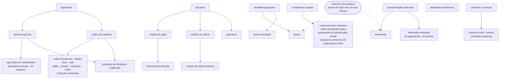

  

# Proposta de curadoria — Campo Semântico "Atividades Econômicas"

### `comunidades.atividadesEconomicas` · 36 termos · 2026-08-17

> **Executada.** Esta proposta foi aplicada em produção em 2026-08-17. O registro da execução, com
> as conferências e o teste de sobrevivência à aquisição, está em
> [`procedimento.md`](procedimento.md); o plano legível por máquina, em
> [`plano-atividades-economicas.json`](plano-atividades-economicas.json).

---

## 1. O que o corpus é

Os 36 termos vêm de **29 registros** do BioCultDB e descrevem o **meio de vida** de comunidades
caiçaras, quilombolas, ribeirinhas, indígenas, caboclas, de pescadores artesanais e de terreiro.
Diferente do campo "Tipos de Usos de Plantas", este corpus chegou **limpo**: nenhum plural solto,
nenhuma grafia incorreta, nenhum termo em inglês, nenhuma variante de regência.

O problema deste campo é outro — ele mistura **três naturezas** de informação:

| Natureza | Termos | Peso |
|---|---:|---|
| Atividade econômica propriamente dita | 32 | maioria |
| Termo composto, que nomeia duas atividades | 1 | `criação de gado e cabras` |
| **Ocupação declarada, e não atividade** | 3 | `lavrador`, `dona de casa`, `estudante` |

E traz uma **granularidade desigual**: `agricultura` (21 ocorrências) convive com
`cultivo de batata-doce` (1), sem nada que os ligue. É essa a hierarquia que faltava.

## 2. A lista curta — o que revisar primeiro

As quatro decisões que não são óbvias, e que um revisor deve conferir antes das demais:

| # | Decisão | Por quê | Alternativa recusada |
|---|---|---|---|
| 1 | **`lavrador` e `dona de casa` viram rótulo oculto** do conceito da atividade que nomeiam (`agricultura`, `atividades domésticas`), com o conceito de origem depreciado | São ocupações — nomeiam a atividade pelo **agente**. O rótulo oculto preserva a busca sem exibir a pessoa como se fosse uma atividade | Rótulo **alternativo**: afirmaria que `lavrador` é outro nome de `agricultura`, o que é falso |
| 2 | **`estudante` é depreciado para `indeterminado`, sem rótulo** | Não nomeia atividade econômica alguma, e **não** é outro nome de `indeterminado` — um rótulo oculto ali afirmaria falsa equivalência | Rótulo oculto em `indeterminado`, por simetria com o item 1 |
| 3 | **`atividades domésticas` é mantido e ativado como faceta** | Que o trabalho doméstico não remunerado seja "atividade econômica" é questão em disputa; o vocabulário **preserva o que a fonte afirmou** em vez de descartá-lo. A ressalva ficou na nota de escopo do conceito | Depreciar para `indeterminado`, tratando-o como ruído |
| 4 | **`pesca` e `artesanato` ganham um 2º pai** (poli-hierarquia entre campos) | Já existem e são compartilhados com "Tipos de Usos de Plantas", onde significam *planta empregada na pesca / em artesanato*. Aqui significam *meio de vida* | Criar conceitos novos homônimos: quebraria a deduplicação da aquisição, que casa por `literalForm` |

> **Consequência do item 4, e é deliberada:** `pesca artesanal` e as duas `fabricação artesanal de…`
> são ligadas **à faceta**, não a `pesca` / `artesanato`. Se pendessem do conceito compartilhado,
> herdariam `material e tecnológico` na cascata de `ancestors` — e uma pescaria artesanal não é um
> uso de planta.

## 3. A árvore proposta

Sete facetas de 1º nível, profundidade máxima 3, poli-hierarquia em três pontos
(`pesca`, `artesanato`, `produção de hortaliças orgânicas`). Verificada sem ciclos.

As sete facetas: `agricultura`, `atividade pesqueira`, `atividades domésticas`,
`comércio e serviços`, `extrativismo vegetal`, `pecuária`, `transformação artesanal`.

**Seis conceitos-pai foram criados** — os demais nós da árvore já existiam como termos coletados:

| Conceito criado | id | Por que precisou existir |
|---|---|---|
| `sistema agrícola` | `5b28911e…` | separar *como/para quê* se cultiva de *o que* se cultiva |
| `cultivo por espécie` | `9ec016d9…` | reunir os 9 termos nomeados pela espécie cultivada |
| `atividade pesqueira` | `67519be7…` | o rótulo `pesca` já pertence ao conceito compartilhado |
| `extrativismo vegetal` | `9edfba35…` | nenhum termo coletado nomeia o ramo |
| `transformação artesanal` | `696cb8ec…` | `artesanato` não cobre farinha e aguardente |
| `comércio e serviços` | `26eff594…` | nenhum termo coletado nomeia o ramo |

## 4. Classificação termo a termo

`MANTER` = conceito próprio, ligado ao pai indicado · `HID` = vira rótulo oculto do alvo e a origem
é depreciada · `HID2` = termo composto, oculto em **dois** conceitos · `DEP` = depreciação simples.

| Termo | Ocorr. | Natureza | Operação | Destino | Justificativa |
|---|---:|---|---|---|---|
| `agricultura` | 21 | ramo ou sistema agrícola | **MANTER** | — (faceta raiz) | faceta: termo genérico do ramo, o mais frequente do corpus (21 ocorrências) |
| `agricultura de pequena escala` | 1 | ramo ou sistema agrícola | **MANTER** | `sistema agrícola` | modalidade pela escala do estabelecimento |
| `agricultura de sequeiro` | 1 | ramo ou sistema agrícola | **MANTER** | `sistema agrícola` | modalidade pelo regime hídrico |
| `agricultura de subsistência` | 12 | ramo ou sistema agrícola | **MANTER** | `sistema agrícola` | modalidade pela finalidade da produção |
| `apicultura` | 1 | criação animal | **MANTER** | `pecuária` | criação de abelhas: é criação animal, logo sob `pecuária` |
| `artesanato` | 1 | transformação artesanal | **MANTER** | `transformação artesanal` | conceito compartilhado com "Tipos de Usos de Plantas"; recebe 2º pai na faceta econômica |
| `atividades domésticas` | 2 | trabalho doméstico | **MANTER** | — (faceta raiz) | faceta: trabalho não remunerado, preservado porque a fonte o declara |
| `bovinocultura de leite` | 1 | criação animal | **MANTER** | `criação de gado` | caso específico de `criação de gado` (aptidão leiteira) |
| `coleta de frutos silvestres` | 1 | extrativismo vegetal | **MANTER** | `extrativismo vegetal` | coleta de produto vegetal silvestre, sem cultivo |
| `coleta do palmito juçara` | 7 | extrativismo vegetal | **MANTER** | `extrativismo vegetal` | coleta de produto vegetal silvestre, sem cultivo |
| `comércio local` | 1 | comércio ou serviço | **MANTER** | `comércio e serviços` | venda de mercadoria |
| `criação de cabras` | 1 | criação animal | **MANTER** | `pecuária` | criação de caprinos |
| `criação de cabras leiteiras` | 1 | criação animal | **MANTER** | `criação de cabras` | caso específico de `criação de cabras` (aptidão leiteira) |
| `criação de gado` | 1 | criação animal | **MANTER** | `pecuária` | entende-se gado como rebanho bovino, leitura que o composto do corpus sustenta |
| `criação de gado e cabras` | 1 | criação animal | **HID2** | depreciado → `criação de gado` | termo composto: nomeia dois conceitos (Manual §7.4) |
| `cultivo de banana` | 1 | cultivo nomeado pela espécie | **MANTER** | `cultivo por espécie` | cultivo nomeado pela espécie cultivada |
| `cultivo de batata-doce` | 1 | cultivo nomeado pela espécie | **MANTER** | `cultivo por espécie` | cultivo nomeado pela espécie cultivada |
| `cultivo de café` | 1 | cultivo nomeado pela espécie | **MANTER** | `cultivo por espécie` | cultivo nomeado pela espécie cultivada |
| `cultivo de feijão` | 1 | cultivo nomeado pela espécie | **MANTER** | `cultivo por espécie` | cultivo nomeado pela espécie cultivada |
| `cultivo de laranja` | 1 | cultivo nomeado pela espécie | **MANTER** | `cultivo por espécie` | cultivo nomeado pela espécie cultivada |
| `cultivo de mandioca` | 1 | cultivo nomeado pela espécie | **MANTER** | `cultivo por espécie` | cultivo nomeado pela espécie cultivada |
| `cultivo de milho` | 1 | cultivo nomeado pela espécie | **MANTER** | `cultivo por espécie` | cultivo nomeado pela espécie cultivada |
| `dona de casa` | 1 | ocupação declarada, não atividade | **HID** | depreciado → `atividades domésticas` | ocupação, não atividade: nomeia o trabalho doméstico pelo agente |
| `estudante` | 1 | ocupação declarada, não atividade | **DEP** | depreciado → `indeterminado` | não nomeia atividade econômica alguma |
| `exploração do palmito para venda` | 7 | extrativismo vegetal | **MANTER** | `extrativismo vegetal` | mesmo recurso da coleta, finalidade comercial: conceito distinto, ligado por RT |
| `fabricação artesanal de aguardente` | 1 | transformação artesanal | **MANTER** | `transformação artesanal` | beneficiamento de alimento/bebida: não é artesanato, liga-se à faceta |
| `fabricação artesanal de farinha` | 1 | transformação artesanal | **MANTER** | `transformação artesanal` | beneficiamento de alimento: não é artesanato, liga-se à faceta |
| `lavrador` | 1 | ocupação declarada, não atividade | **HID** | depreciado → `agricultura` | ocupação, não atividade: nomeia a agricultura pelo agente |
| `manejo de sementes de juçara para venda` | 7 | extrativismo vegetal | **MANTER** | `extrativismo vegetal` | manejo de população nativa, produto distinto do palmito: RT com a coleta |
| `monitoria ambiental` | 2 | comércio ou serviço | **MANTER** | `comércio e serviços` | serviço remunerado, executado em unidade de conservação |
| `pecuária` | 2 | criação animal | **MANTER** | — (faceta raiz) | faceta: termo genérico da criação animal, abrange também a apicultura |
| `pesca` | 7 | pesca | **MANTER** | `atividade pesqueira` | conceito compartilhado com "Tipos de Usos de Plantas"; recebe 2º pai na faceta econômica |
| `pesca artesanal` | 2 | pesca | **MANTER** | `atividade pesqueira` | ligado à faceta, e não a `pesca`, para não herdar o ramo `material e tecnológico` |
| `produção canavieira` | 1 | cultivo nomeado pela espécie | **MANTER** | `cultivo por espécie` | designação consagrada da lavoura de cana; nomeia a espécie cultivada |
| `produção de hortaliças orgânicas` | 1 | cultivo nomeado pela espécie | **MANTER** | `cultivo por espécie` · `sistema agrícola` | nomeia a espécie (hortaliças) e o sistema (orgânico): poli-hierarquia deliberada, os dois pais |
| `turismo` | 6 | comércio ou serviço | **MANTER** | `comércio e serviços` | serviço prestado por moradores |

## 5. Relações associativas (RT)

Duas, todas no complexo da juçara — o caso em que o mesmo recurso sustenta atividades distintas:

| A | B | Por quê |
|---|---|---|
| `exploração do palmito para venda` | `coleta do palmito juçara` | mesmo recurso, finalidades diferentes (venda × consumo) |
| `manejo de sementes de juçara para venda` | `coleta do palmito juçara` | mesma espécie, produtos diferentes — e a semente é a alternativa que não mata a palmeira |

## 6. O que **não** se aplicou neste campo

Registro honesto do que a curadoria de "Tipos de Usos de Plantas" usou e aqui não coube:

- **Rótulo alternativo (`alt`): zero.** Não há plural, variante de regência nem tradução no corpus.
- **Sinônimo (aceito): zero.** Todos os termos chegaram crus, sem definição ou proveniência própria
  a preservar — vale a preferência do Manual §7 por um conceito com vários rótulos.
- **Reclassificação de `accessLevel`: zero.** Os 36 rótulos são `public`, em português, e nenhum vem
  de língua indígena. O CARE segue teórico aqui, como foi em "Tipos de Usos de Plantas"; ele deixa de
  ser no campo `nomeVernacular`.
- **Conceito mantido como `candidate`: zero.** Os 36 termos resolveram-se sem dúvida residual — o
  corpus é pequeno e limpo. As dúvidas que existiram eram **de fronteira**, não de significado, e
  foram gravadas nas notas de escopo dos nós, não deixadas como pendência de status.

---

> **Referências:** [Manual de Curadoria](https://edalcin.github.io/BioCultTermos/) ·
> [W3C SKOS-XL](https://www.w3.org/TR/skos-reference/skos-xl.html) ·
> [Princípios CARE](https://www.gida-global.org/care)
