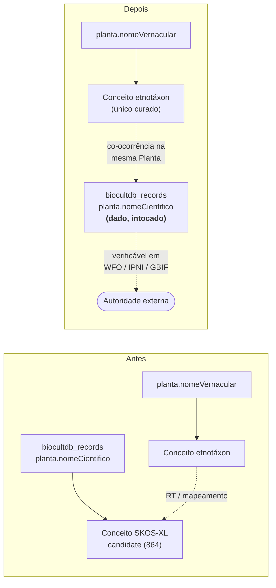

# Decisão — "Nomes Científicos de Plantas" sai do escopo do BioCultTermos

> **Questão.** O Campo Semântico **"Nomes Científicos de Plantas"**
> (`comunidades.plantas.nomeCientifico`) deve continuar sob curadoria do BioCultTermos, em todas as
> unidades federadas? O conceito de "nome científico" já é consolidado na academia e regido pelo
> **ICN**, com suas próprias marcações de *nome aceito*, *sinônimo*, *basiônimo* e autoria.
>
> **Data:** 2026-08-10 · **Status:** aceita, aguardando execução ·
> **Antecedente:** [`avaliacao-campos-semanticos.md`](avaliacao-campos-semanticos.md)

## Veredito

**Concordo. O campo sai do escopo do vocabulário controlado.** A razão não é apenas que o nome
científico já é regido por um código externo — é que **não existe decisão de curadoria legítima a
tomar sobre ele dentro do BioCultTermos**. Todas as operações que a ferramenta oferece são, para um
binômio latino, ou inertes ou ilegítimas.

O nome científico **permanece dado de primeira classe do BioCultDB**: campo obrigatório da Planta,
no formulário, na validação, na busca FTS, nas estatísticas e no etnoChat. O que termina é o seu
espelhamento como conceito SKOS-XL curável.

## Por que concordo

### 1. A curadoria não tem o que decidir

Confronte a paleta de operações do BioCultTermos com um nome científico:

| Operação | Sobre um nome vernacular | Sobre um nome científico |
|---|---|---|
| `pref` / `alt` / `hidden` | Escolha real: nomes co-iguais da comunidade (Avaliação 2) | Só grafia errada — problema de dado, não de conceito |
| Hierarquia BT/NT | Etnotáxons se aninham por significado cultural | Já existe: gênero → família → ordem, fora daqui |
| "Sinônimo de (aceito)" | Decisão do curador | **Decisão do ICN e da revisão taxonômica** — o curador não pode decidi-la |
| Depreciar com `replacedBy` | Termo inadequado ou colonial | Rebaixamento nomenclatural, publicado em literatura externa |
| `accessLevel`, `sourcePeople`, `holderPeople` | O coração do CARE | Inerte: binômio latino é público por construção |
| Nota de escopo | Delimita o significado cultural | Duplica a descrição do protólogo |

Sobram operações inertes e uma perigosa: um curador **pode** afirmar uma sinonímia que contradiz o
código nomenclatural, e a interface aceitaria. Manter o campo é manter uma superfície de erro sem
contrapartida de valor.

### 2. É um espelho local, e desatualizado, de uma autoridade global

Nome aceito, sinonímia homotípica/heterotípica, basiônimo, autoria e ano já vivem em **WFO, IPNI,
POWO e no backbone do GBIF**, com identificadores estáveis e revisão contínua. 864 conceitos
curados à mão são uma cópia que nasce desatualizada e que ninguém se comprometeu a reconciliar. É
a maior massa de dívida de manutenção do vocabulário e a de menor valor.

### 3. Contradiz a premissa fundadora do próprio BioCultTermos

O README do BioCultTermos abre dizendo que a arquitetura de informação não deve ser colonizadora —
que trate os termos das línguas indígenas como protagonistas, **não como apêndices subordinados à
nomenclatura científica ocidental**. Manter "Nomes Científicos" como Campo Semântico **par** dos
nomes vernaculares, na mesma tela, com o mesmo peso e sob o mesmo papel de curador, é exatamente a
equiparação que a premissa recusa. A Avaliação 1 já barrou a conflação **no nível do conceito**;
esta decisão a barra **no nível do campo**.

### 4. O custo de sair é baixo, e nenhum é custo de dado

O acoplamento é unidirecional e mínimo: o `AcquisitionService` lê `biocultdb_records` e semeia
conceitos. **Nada no BioCultDB consulta o vocabulário** para validar, autocompletar ou exibir nome
científico. Remover o campo do escopo é remover uma entrada de uma lista de cinco strings, mais
rótulos de interface e documentação. Nenhuma migração, nenhuma exclusão.

## Contra-argumentos considerados

**"A curadoria normaliza grafias vindas da extração por IA e do OCR."**
Normaliza no vocabulário, não no dado. O conceito curado **não reescreve** `biocultdb_records` — o
registro continua com a grafia errada, e a busca do BioCultDB continua falhando nela. O conserto
tem de acontecer na origem (prompt de extração, validação na Aquisição, ou casamento contra
autoridade externa). Curar a cópia é decorativo para este fim.

**"O público perde um índice navegável de espécies."**
Ele nunca existiu, por dois motivos independentes: os conceitos de nome científico estão todos
`candidate`, e a interface pública lista apenas `active`; além disso o bloco de cartões "Campos
semânticos" da home é código morto e nunca renderizou para campo nenhum (ver Fase 0).

**"Outra unidade federada (BioCultRelatos, BioCultAcervos) pode querer curar nomes científicos."**
O argumento vale igual, ou pior: a autoridade nomenclatural é **global**, então uma cópia *por
unidade* multiplica a divergência. Esta decisão vale para a Arquitetura BioCultural inteira, não só
para a Unidade de Fontes Secundárias.

## O que muda e o que não muda

| | Antes | Depois |
|---|---|---|
| `comunidades.plantas.nomeCientifico` no BioCultDB | Campo obrigatório da Planta | **Igual** — formulário, validação, FTS, estatísticas, etnoChat |
| Campos monitorados pela Aquisição | 5 | **4** — tipo de comunidade, nome vernacular, tipo de uso, atividade econômica |
| Os 864 conceitos já semeados | `candidate`, nunca curados | **Preservados e legíveis**, congelados, fora da fila de curadoria |
| Fontes de um conceito legado (`SourceService`) | Resolve | **Igual** — o resolvedor do campo permanece, só de leitura |
| Ponte vernacular ↔ científico | Prevista como RT entre conceitos | Referência **externa** (WFO/IPNI), fora do escopo desta entrega |



## O que se perde — e por que é aceitável

A Avaliação 1 recomendou ligar etnotáxon e nome científico por **mapeamento SKOS**
(`closeMatch` / `broadMatch` / `narrowMatch`). Sem o conceito científico local, o mapeamento perde
o alvo *local*. Três razões para aceitar:

1. **A associação já está no dado, e é a associação certa.** Em `biocultdb_records`,
   `nomeCientifico` e `nomeVernacular` são irmãos dentro do mesmo objeto `planta` — o vínculo é
   registrado por Evidência, com a proveniência bibliográfica junto. É exatamente o que o Darwin
   Core faz: `vernacularName` como atributo **associado** ao táxon, muitos-para-um.
2. **Nada operacional se perde hoje.** `SourceService.findSourcesForConcept` já leva o curador de
   um conceito vernacular às Evidências que o citam — e essas Evidências carregam os nomes
   científicos. A ponte é navegável sem o conceito espelho.
3. **A forma correta do mapeamento é externa, e ainda não tem consumidor.** O alvo certo de um
   `skos:exactMatch` é a URI da autoridade (WFO/IPNI/GBIF), não um gêmeo curado à mão. Construir
   isso agora seria especulação: não há requisito, não há consumidor, e o modelo de relações atual
   só liga IDs locais.

> `ponytail:` mapeamento externo deliberadamente não construído. **Gatilho para construir:** quando
> houver um consumidor real — publicação do vocabulário como RDF, ou exportação Darwin Core
> Archive com extensão *VernacularName*. Aí o campo a criar é um `externalMatch`
> (`{ uri, authority, verifiedAt }`) no conceito vernacular, não um Campo Semântico de volta.

## Plano de implementação

Quatro fases. **Nenhuma toca dado.** Fases 1 e 2 podem correr em paralelo; a 3 depende das duas.

### Fase 0 — Linha de base em produção (somente leitura, **não bloqueante**)

> **Correção de 2026-08-10, depois da Fase 1.** Esta fase foi redigida supondo que ela decidiria se
> a home pública precisava de um rótulo para o campo. **Não decide nada:** o bloco "Campos
> semânticos" de `public/views/index.ejs:47-70` itera `sourceGroups`, variável que **nenhuma rota
> jamais define** — a rota `public/routes/index.js:24-29` passa `sourceFields`. O `typeof
> sourceGroups !== 'undefined'` engole o bloco em silêncio: os cartões nunca renderizam, e o
> `FIELD_LABELS` ao lado é código morto. Achado **pré-existente**, alheio a esta decisão; anotado
> aqui e deixado para tratamento em separado. Consequência: **nada a fazer na interface pública**, e
> a Fase 0 vira apenas linha de base de verificação — pode rodar junto com a Fase 3.

Rodar contra o SQLite de produção; serve de linha de base para a tabela de verificação da Fase 3:

```sql
-- 1. Distribuição por campo × status (confirma "nenhum active" e o total de 864)
SELECT je.value AS campo,
       json_extract(e.doc,'$.status') AS status,
       COUNT(*) AS n
FROM etnotermos e, json_each(json_extract(e.doc,'$.sourceFields')) je
GROUP BY campo, status
ORDER BY campo, status;

-- 2. Conceitos com sourceFields MISTO (científico + outro campo) — não podem ser tratados
--    como legado puro: continuam vivos pelo outro campo
SELECT COUNT(*) AS mistos
FROM etnotermos e
WHERE EXISTS (SELECT 1 FROM json_each(json_extract(e.doc,'$.sourceFields')) je
              WHERE je.value = 'comunidades.plantas.nomeCientifico')
  AND json_array_length(json_extract(e.doc,'$.sourceFields')) > 1;

-- 3. Relações já criadas a partir de um conceito científico (esperado: 0)
SELECT COUNT(*) AS com_relacoes
FROM etnotermos e
WHERE EXISTS (SELECT 1 FROM json_each(json_extract(e.doc,'$.sourceFields')) je
              WHERE je.value = 'comunidades.plantas.nomeCientifico')
  AND (json_array_length(COALESCE(json_extract(e.doc,'$.broader'),'[]')) > 0
    OR json_array_length(COALESCE(json_extract(e.doc,'$.narrower'),'[]')) > 0
    OR json_array_length(COALESCE(json_extract(e.doc,'$.related'),'[]')) > 0);
```

A consulta 1 dá o número exato de conceitos por campo × status. Guarde a saída: é contra ela que a
Fase 3 prova que **nenhum dado se moveu**.

Backup do SQLite antes do *redeploy*, pela convenção do
[§7 do procedimento](tipos-de-uso/procedimento.md#7-backup-e-recuperação).

### Fase 1 — Código do BioCultTermos (submódulo `bioculttermos/`)

| Arquivo | Alteração |
|---|---|
| `backend/src/services/AcquisitionService.js:10-16` | Remover `'comunidades.plantas.nomeCientifico'` de `MONITORED_FIELDS`; comentar por quê, com ponteiro para esta decisão |
| `backend/src/services/AcquisitionService.js:79-83` | Remover a chamada `collect(...)` do laço de plantas |
| `backend/src/services/SourceService.js:19-20` | **Manter** o construtor de SQL — os conceitos legados precisam continuar resolvendo suas Fontes. Marcar como legado, somente leitura |
| `backend/src/contexts/admin/views/concepts/list.ejs:72` | Manter a opção do filtro (o curador precisa achar o legado), relabelar: `Nomes Científicos de Plantas (histórico — fora de escopo)` |
| `backend/src/contexts/public/views/index.ejs` | **Nada a fazer** — o bloco de cartões é código morto (ver Fase 0) |
| `backend/tests/unit/acquisition-service.test.js:242-265` | Inverter o teste: nome científico presente no registro **não** gera conceito. É a prova executável do escopo |
| `backend/tests/contract/admin-concepts-api.test.js:280-287` | Continua válido (o `value` da opção permanece). Só confirmar que passa |

### Fase 2 — Documentação

**No submódulo `bioculttermos/`:**

| Arquivo | Alteração |
|---|---|
| `README.md:257` | "Campos gerenciados": quatro campos; nota de uma linha sobre o legado congelado |
| `CHANGELOG.md` | Entrada nova apontando para esta decisão |
| `manual/07-guia-de-decisao.md` §7.2 (l. 80-88) e §7.3 (l. 94-139) | Reescrever a **conclusão**, preservando o **raciocínio**: nome científico e vernacular continuam não sendo o mesmo conceito — só que agora o científico não é conceito **aqui**. Fica dado do BioCultDB + autoridade externa. Atualizar os dois diagramas |
| `manual/10-campo-semantico-inteiro.md:14-18, 86` | Tabela: marcar a linha `nomeCientifico` como fora de escopo (número preservado como registro histórico) |
| `manual/11-erros-comuns.md` | Linha nova: "Curar um nome científico" → fora de escopo, ver §7.3 |
| `manual/12-glossario.md:17` | Verbete "Campo Semântico": os quatro campos em escopo |

> O manual é publicado por MkDocs em `edalcin.github.io/BioCultTermos` — a Fase 2 exige
> republicação.

**Neste repositório:**

| Arquivo | Alteração |
|---|---|
| `CONTEXT.md:92-95` | Verbete "Vocabulário Controlado": retirar "nomes científicos" da lista de campos governados |
| `README.md:217-221` | "**5 campos monitorados**" → **4**; retirar "nome científico" da enumeração |
| `integracao.md:264` | Verbete de glossário do `AcquisitionService`: 5 → 4 campos |
| `integracao.md:27-31, 311-320, 340-343` | **Registro histórico — não reescrever.** Acrescentar uma linha de remissão a esta decisão em cada ponto |
| `docs/curadoria/tipos-de-uso/procedimento.md:408-429, 947` | §8 é receita prospectiva: tirar `nomeCientifico` da lista de campos ainda por curar. A tabela de distribuição (l. 89-93) é instantâneo histórico — preservar |
| `docs/curadoria/avaliacao-campos-semanticos.md` | Nota de cabeçalho remetendo a esta decisão *(feito)* |
| `docs/README.md` | Entrada no índice *(feito)* |

**Fora de escopo desta entrega:** `bioculttermos/docs/skill/*.md` (dois arquivos duplicados,
anteriores ao modelo SKOS-XL atual, já divergentes do Manual) e
`bioculttermos/specs/**` (registro do processo de especificação original).

### Fase 3 — Implantação e verificação

1. *Commit* no submódulo, *commit* do ponteiro no BioCultDB, *push* de ambos (só `main`).
2. Reconstruir a imagem e redeployar o container, pelo
   [runbook de produção](../operacao/corte-producao-unidade.md).
3. **Verificação — cada afirmação com sua prova:**

| Afirmação | Prova |
|---|---|
| A aquisição não semeia mais nome científico | Rodar "Executar Aquisição"; o log da execução não traz a linha do campo, e o total de conceitos fica **inalterado** |
| Nenhum dado apagado | Repetir a consulta 1 da Fase 0: os números por campo × status são **idênticos** aos da linha de base |
| O legado continua acessível | Filtrar por "Nomes Científicos de Plantas (histórico…)" no Admin; abrir um conceito e confirmar que o painel **Fontes** ainda resolve |
| Os quatro campos restantes continuam íntegros | Aquisição com `criados=0` nos quatro |
| O BioCultDB não regrediu | Busca por planta (nome científico) na Apresentação continua retornando; painel analítico mantém o "Top plantas" |

### Reversão

Reverter os dois *commits* e redeployar. Como **nenhuma fase escreve em `etnotermos`**, não há
restauração de dado: o campo volta ao `MONITORED_FIELDS` e a próxima aquisição reencontra os 864
conceitos exatamente onde estavam. O backup da Fase 0 cobre apenas o risco genérico do *redeploy*.

## Invariante desta decisão

> **Nenhum dado é apagado.** Nem o `nomeCientifico` das Evidências em `biocultdb_records`, nem os
> conceitos já semeados em `etnotermos`. A mudança é de **escopo de curadoria**, executada como
> "parar de semear + relabelar" — nunca como migração ou expurgo. Qualquer variante deste plano que
> proponha `DELETE`, `UPDATE` em massa ou depreciação em lote dos 864 conceitos **contraria esta
> decisão**.

---

> **Padrões de referência:** [ICN](https://www.iapt-taxon.org/nomen/main.php) ·
> [World Flora Online](https://www.worldfloraonline.org/) ·
> [IPNI](https://www.ipni.org/) ·
> [Darwin Core (TDWG)](https://dwc.tdwg.org/) ·
> [W3C SKOS-XL](https://www.w3.org/TR/skos-reference/skos-xl.html) ·
> [Princípios CARE](https://www.gida-global.org/care)
