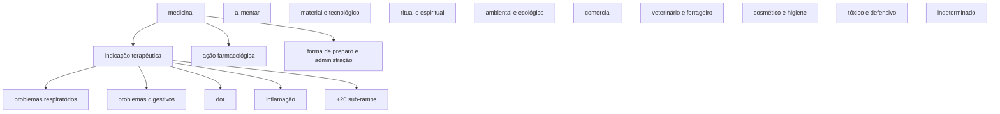
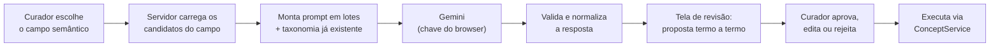

<div align="center">
  
</div>

# Curadoria assistida de Campo Semântico — procedimento, riscos e relatório

### Campo "Tipos de Usos de Plantas" (`comunidades.plantas.tipoUso`, 713 termos)

> **Estado em 2026-08-07: EXECUTADA em produção.** As cinco fases do §6 foram aplicadas pela API Admin
> na porta 4001, com o container no ar, sobre o backup `backup-pre-curadoria-tipouso-2026-08-07T08-31-59Z.sqlite`.
> Resultado: **713 → 332 conceitos** no campo (305 `active`, 27 `candidate` mais `fumo`, 411 `deprecated`),
> 1509 entradas de auditoria, e a curadoria **verificada sobrevivente** a um ciclo completo de aquisição
> (`criados=0`, contagens idênticas). O registro da execução está no [§14](#14-registro-da-execução).
> A proposta termo a termo está em [`proposta.md`](proposta.md);
> o plano, agora com as divergências do curador aplicadas e os ids dos conceitos criados, em
> [`plano-tipouso.json`](plano-tipouso.json).
> Este documento registra **o que foi apurado, o que foi decidido, como se executa e o que a execução
> devolveu** — inclusive como repetir o processo em outro campo semântico e como embuti-lo na interface.

---

## Sumário

1. [O que este procedimento faz](#1-o-que-este-procedimento-faz)
2. [Levantamento do estado de produção](#2-levantamento-do-estado-de-produção)
3. [O risco que domina o desenho: a aquisição desfazer a curadoria](#3-o-risco-que-domina-o-desenho-a-aquisição-desfazer-a-curadoria)
4. [Desenho da taxonomia](#4-desenho-da-taxonomia)
5. [Regras de decisão aplicadas](#5-regras-de-decisão-aplicadas)
6. [Procedimento de execução](#6-procedimento-de-execução)
7. [Backup e recuperação](#7-backup-e-recuperação)
8. [Repetindo em outro Campo Semântico](#8-repetindo-em-outro-campo-semântico)
9. [Implementação futura na interface, com Gemini](#9-implementação-futura-na-interface-com-gemini)
10. [Registro da sessão de planejamento](#10-registro-da-sessão-de-planejamento-2026-08-06)
11. [Registro de decisões](#11-registro-de-decisões)
12. [Pendências e decisões em aberto](#12-pendências-e-decisões-em-aberto)
13. [Como retomar na próxima sessão](#13-como-retomar-na-próxima-sessão)
14. [Registro da execução](#14-registro-da-execução)

---

## 1. O que este procedimento faz

Transforma uma lista bruta de termos de um campo semântico — como a aquisição a deposita, cada grafia
virando um conceito candidato isolado — numa rede SKOS-XL curada, conforme o [Manual de Curadoria](https://edalcin.github.io/BioCultTermos/):
plurais e variantes recolhidos como rótulos, grafias incorretas escondidas mas buscáveis, e uma
hierarquia navegável de conceitos.

O ganho concreto é o que o Manual §1 promete: hoje `asma`, `bronquite`, `tosse` e `gripe` estão soltas e
a pergunta *"quais plantas tratam problemas respiratórios?"* não tem resposta. Depois da curadoria, tem.

**Entrada:** os conceitos `candidate` de um campo semântico.
**Saída:** hierarquia + rótulos + definições, com trilha de auditoria por conceito.

---

## 2. Levantamento do estado de produção

Apurado por acesso direto ao servidor, somente leitura, em 2026-08-06.

### 2.1 Infraestrutura

| Item | Valor |
|---|---|
| Host | `<HOST_UNRAID>` (`<HOST_HOSTNAME>`, Unraid 6.18.38) |
| Acesso | `ssh -i <chave> root@<HOST_UNRAID>` |
| Container | `BioCultDB`, imagem `ghcr.io/edalcin/biocultdb:latest`, `TZ=America/Sao_Paulo` |
| Banco | `<APPDATA>/biocultdb/data/biocultdb.sqlite` (host) → `/data/biocultdb.sqlite` (container) |
| Journal | **WAL ativo** — implica que o backup consistente **não exige parar o container** (ver §7) |
| Portas | 3091→3001, 3092→3002, 3093→3003 (BioCultDB) · 4000 (BioCultTermos público) · 4001 (BioCultTermos admin) |
| Auth admin | Basic Auth, `ADMIN_USERNAME=<ADMIN_USERNAME>`, senha no env do container |

> **Convenção deste documento:** identificadores da instalação de produção aparecem como
> placeholders — `<HOST_UNRAID>` (endereço do servidor), `<HOST_HOSTNAME>` (nome do host),
> `<APPDATA>` (diretório de appdata do Unraid), `<ADMIN_USERNAME>` e `<ADMIN_PASSWORD>`. Quem for
> executar substitui pelos valores reais, que vivem no env do container e não em documento
> versionado. Em blocos `bash`, exporte-os antes: `HOST=<HOST_UNRAID>`, `APPDATA=<APPDATA>`.

### 2.2 Modelo de dados

Não há tabela relacional de conceitos: `etnotermos` guarda **um documento JSON por conceito**
(`id`, `doc`, `created_at`, `updated_at`), com `status` e `version` como colunas geradas, e uma
tabela virtual FTS5 (`etnotermos_fts`) para busca.

O **Campo Semântico não é um campo próprio** — é o array `doc.sourceFields`, preenchido pela
aquisição com o caminho do campo de origem no registro do BioCultDB. Distribuição atual:

| `sourceFields` | Conceitos |
|---|---:|
| `comunidades.plantas.nomeVernacular` | 982 |
| `comunidades.plantas.nomeCientifico` | 864 |
| **`comunidades.plantas.tipoUso`** | **713** |
| `comunidades.atividadesEconomicas` | 36 |
| `comunidades.tipo` | 9 |

Um conceito pode pertencer a mais de um campo: `fumo`, `artesanato` e `pesca` têm dois `sourceFields`.

### 2.3 Estado do campo a curar

712 dos 713 conceitos estão `candidate` (só `medicinal` está `active`), e o campo é uma
**folha em branco**: zero definições, zero relações, zero rótulos alternativos, zero ocultos.
Todos os 713 rótulos estão com `language: "pt"` e `accessLevel: "public"`.

Composição do corpus, que é o problema real — o campo chamado "tipos de uso" contém cinco coisas diferentes:

| Natureza | Exemplos | Peso |
|---|---|---|
| Finalidade de uso | `alimentício`, `construção`, `artesanato`, `ritual` | pequeno |
| Enfermidade ou sintoma tratado | `asma`, `dor de cabeça`, `febre` | **maioria** |
| Ação farmacológica atribuída | `diurético`, `expectorante`, `cicatrizante` | médio |
| Parte do corpo, sem enfermidade | `fígado`, `rins`, `peito` | pequeno |
| Objeto produzido | `cesto`, `ponta de flecha`, `velas` | pequeno |
| Ruído | `outros`, `dúvida`, `não especificado`, `enferrujado` | 11 termos |

Somam-se a isso 44 rótulos em inglês gravados como português, 9 grafias incorretas, 17 termos
compostos (`gripe e tosse`) e ~120 variantes de regência ou número da mesma ideia
(`dor de estômago` / `dor no estômago` / `dores estomacais` / `stomache`).

### 2.4 Superfície de escrita disponível

A API Admin (porta 4001) cobre toda a operação e **aplica os invariantes** — este é o motivo de
executar por ela e não escrevendo no SQLite:

| Rota | Efeito |
|---|---|
| `POST /concepts/:id/labels` | adiciona rótulo (`pref`/`alt`/`hidden`, idioma, `accessLevel`, proveniência) |
| `POST /concepts/:id/labels/:labelId/promote` | troca atômica do preferencial |
| `PUT /concepts/:id` | definição, nota de escopo, nota histórica, exemplo |
| `POST /concepts/:id/broader` | hierarquia — com bloqueio de ciclo e cascata de `ancestors` |
| `POST /concepts/:id/related` · `/synonym` | associação e sinonímia, com exclusão mútua entre as duas |
| `POST /concepts/:id/activate` · `/deprecate` | ciclo de vida |

Toda escrita exige `version` (bloqueio otimista, `409` em conflito) e grava em `etnotermos_audit_log`
com o usuário responsável. **Não existe** endpoint de exclusão de conceito nem de operação em massa.

---

## 3. O risco que domina o desenho: a aquisição desfazer a curadoria

Este é o achado que muda o plano, e ele não é óbvio a partir da interface.

`AcquisitionService.run()` semeia duas fontes: os valores minerados de `biocultdb_records` (259 dos
713 termos) e a lista estática `REFERENCE_TERMS` (os outros 454). Para cada termo, chama
`upsertConcept`, que **decidia** se o termo já existe com esta consulta:

```sql
SELECT doc FROM etnotermos e
WHERE EXISTS (
  SELECT 1 FROM json_each(json_extract(e.doc,'$.prefLabels')) je
  WHERE json_extract(je.value,'$.literalForm') = ? AND json_extract(je.value,'$.type') = 'pref'
)
```

Ela olhava **apenas os `prefLabels`**. Ignorava `altLabels` e `hiddenLabels`.

Consequência direta: **toda curadoria que tira um termo da posição de preferencial era desfeita na
aquisição seguinte.**

| Operação de curadoria | Sobrevivia à aquisição? | Por quê |
|---|:---:|---|
| Recolher `gripes` como `alt` de `gripe` e apagar o conceito de origem | ❌ | `gripes` some dos `prefLabels` → recriado como conceito candidato novo |
| Promover `diarreia` a preferencial, rebaixando `diarréia` a oculto | ❌ | `diarréia` sai dos `prefLabels` → recriado |
| Depreciar `gripes` apontando `gripe` como substituto | ✅ | o conceito depreciado **mantém** seu `prefLabel`; o upsert o encontra e não recria |
| Adicionar `broader`, definição, nota | ✅ | não mexe em `prefLabels` |

O defeito tem **duas camadas**, e as duas foram fechadas.

### 3.1 A causa — `upsertConcept` só casava em `prefLabels`

Havia duas saídas. **A escolhida e já implantada foi (b): corrigir a raiz.**

**(a) Conviver com a limitação.** Nunca remover um termo da posição de preferencial: cada fusão vira
*adicionar o rótulo no conceito-alvo* **e** *depreciar o conceito de origem apontando o alvo*. O termo
sobrevive como preferencial de uma lápide, o upsert o reconhece, nada é recriado. Zero código, mas o
vocabulário termina com ~416 conceitos depreciados ao lado de 328 vivos — para sempre.

**(b) Corrigir a raiz — feito.** `upsertConcept` passa a verificar a existência do termo em
`prefLabels`, `altLabels` **e** `hiddenLabels`. Fusão limpa passa a ser possível: o termo vira rótulo
e o conceito de origem simplesmente deixa de existir, sem lápide.

| Item | Valor |
|---|---|
| Commit no submódulo | `3a277cb` (`edalcin/BioCultTermos@main`) |
| Ponteiro do submódulo | `65a4d4f` em `edalcin/BioCultDB@main` |
| Imagem publicada | build `31f84b5`, CI success |
| Em produção | `BUILD_INFO.biocultdb_commit=31f84b5…`, container `healthy` |
| Testes | 3 novos em `acquisition-service.test.js`; verificado que **falham** com o código anterior |
| Custo | ciclo completo de aquisição: 2601 termos, consulta antiga 38,2 s → nova 44,2 s (**1,16×**) — o custo dominante é a varredura completa de tabela, que já existia |

Junto foi corrigido o código de idioma (`pt` → `por`, pendência 2), no mesmo commit, com migração
idempotente em `backend/scripts/migrate-language-pt-to-por.js`.

### 3.2 O amplificador — a aquisição rodava sozinha, de madrugada

A causa era o `upsertConcept`. O que transformava um defeito em **risco** era rodar sem ninguém
olhando: um agendador `node-cron` disparava `run()` todo dia às 03:00, então uma curadoria feita à
tarde podia estar desfeita antes do café, sem clique, sem aviso e sem ninguém para relacionar as duas
coisas.

**Eliminado em 2026-08-07, por decisão do curador (D14).** O agendador não existe mais: nem o módulo,
nem a dependência `node-cron`, nem a env var. A aquisição acontece **exclusivamente sob demanda**, no
botão **"Executar Aquisição"** do dashboard admin (`POST /acquisition/run`).

### 3.3 Curar enquanto uma aquisição roda é seguro — e a frase anterior estava errada

Esta seção afirmava que uma aquisição concorrente "colide com o bloqueio otimista e devolve `409` no
meio do lote". **Isso é falso**, e a afirmação foi refutada por teste (D15). O mecanismo, lido com
cuidado:

| Peça | O que faz | Consequência |
|---|---|---|
| `upsertConcept` (aquisição) | para um conceito já existente, faz `UPDATE` do documento tocando só `sourceFields`, `sourceCommunities` e `updatedAt` — **sem mexer em `version`** | não há como disparar o `409`, que só ocorre quando a `version` mudou |
| `optimisticUpdate` (curadoria) | relê o documento **dentro** da transação, compara a `version`, aplica a mutação no documento fresco | não escreve a partir de cópia velha, então não perde a alteração da aquisição |
| `better-sqlite3` | driver **síncrono**, e admin e aquisição vivem no **mesmo processo** Node | o par ler-escrever de cada termo é atômico; nada se intercala no meio dele |

O único ponto de intercalação é o `await` que a aquisição faz a cada 40 termos para não travar a
interface — e ali uma escrita de curadoria completa inteira, sem estado partido.

Dois testes em `acquisition-service.test.js` guardam isso: um cura (adiciona rótulo, grava definição)
com um ciclo no ar e exige que nada dê `409` nem se perca; o outro absorve um termo como rótulo
alternativo, deprecia a origem, roda um ciclo e exige que nada seja recriado.

O que sobrava de verdade era **desperdício e confusão**, não corrupção: dois ciclos simultâneos
refazem a mesma varredura de ~40 s e gravam duas entradas de log, e o botão não dava sinal algum de
que havia um ciclo no ar. Isso foi resolvido na interface — ver D15.

---

## 4. Desenho da taxonomia

Uma árvore só, com dez facetas de 1º nível, profundidade máxima 5, poli-hierarquia permitida onde
o significado exige. Verificada sem ciclos.



Três decisões estruturais merecem registro:

**Doenças ficam sob `medicinal`, não em campo separado.** É o que o Manual §6.1 e §9 já desenham. A
alternativa — separar "finalidade de uso" de "indicação terapêutica" em dois campos semânticos —
exigiria mudar `MONITORED_FIELDS` e a origem do dado no BioCultDB, e não se justifica.

**Distinguir indicação de ação farmacológica.** `febre` (o que a pessoa tem) e `antitérmico` (o que a
planta faz) são conceitos diferentes e ficam em ramos irmãos sob `medicinal`. Confundi-los é o erro
que mais aparece no corpus bruto.

**Criar a faceta `indeterminado`.** Não é elegância, é necessidade: `POST /concepts/:id/deprecate`
**exige** `replacedById`, e não existe substituto legítimo para `outros`, `dúvida` ou
`não especificado`. Sem um destino terminal explícito, esses 11 termos ficariam `candidate` para
sempre — que é justamente o erro que o [Manual §11](https://edalcin.github.io/BioCultTermos/11-erros-comuns.html) lista.

---

## 5. Regras de decisão aplicadas

Aplicação direta do fluxo do Manual §7, na ordem em que cada teste é feito:

| Situação no corpus | Teste | Decisão | Exemplo |
|---|---|---|---|
| Plural do mesmo termo | mesma ideia, mesmo conceito | rótulo **alternativo** | `gripes` → `gripe` |
| Variante de regência | mesma ideia | rótulo **alternativo** | `dor de estômago`, `dores estomacais` → `dor no estômago` |
| Grafia incorreta ou pré-Acordo | mesma ideia, forma errada | rótulo **oculto** | `diarréia`, `gazes`, `hemorróidas` |
| Termo em inglês | mesma ideia, outro idioma | rótulo **alternativo**, `language: eng` | `headache` → `dor de cabeça` |
| Caso específico de outro | é um tipo de | **hierarquia** (`broader`) | `dor de cabeça` → `dor` |
| Distintos mas associados | nem tipo, nem sinônimo | **relacionado (RT)** | `gripe` ↔ `resfriado` |
| Termo composto | nomeia dois conceitos | **rótulo oculto nos dois** + depreciar apontando o primeiro (D6) | `gripe e tosse` → oculto em `gripe` e em `tosse` |
| Qualificador colado | um conceito + detalhe do artefato | **depreciar** apontando o núcleo (D7) | `construção (caibros e ripas…)` → `construção` |
| Sem conteúdo informativo | não nomeia uso algum | **depreciar** → `indeterminado` | `outros`, `dúvida` |
| Pertence a outro campo | nome vernacular no campo errado | **não tocar** | `fumo` |

Nenhum caso do corpus justificou a relação **"Sinônimo de (aceito)"** — ela existe para reconciliar
conceitos que já foram curados separadamente, com definição e proveniência próprias (Manual §6.3), e
aqui todos os 713 chegaram crus, sem história a preservar. Vale a preferência do Manual §7:
um conceito com vários rótulos, não vários conceitos ligados por sinonímia.

Sobre **CARE**: os 713 rótulos são `public` e nenhum vem de língua indígena — são termos de uso
recolhidos da literatura, em português e inglês. Nenhuma reclassificação de `accessLevel` se aplica
neste campo. Isso **mudará** no campo `nomeVernacular`, onde os nomes têm povo de origem e podem
exigir `restricted` ou `sacred` (Manual §3.3).

---

## 6. Procedimento de execução

Cinco fases. Cada uma é verificável antes da seguinte.

### Fase 0 — Preparar

1. Backup consistente (§7).
2. Confirmar que a correção de `upsertConcept` está em produção, **ou** assumir explicitamente o
   padrão (a) do §3.
3. Nada a coordenar quanto à aquisição: curar com um ciclo no ar é seguro (§3.3), e a interface
   recusa um segundo ciclo simultâneo (D15).
4. Ler `ADMIN_PASSWORD` do env do container; autenticar em `http://<HOST_UNRAID>:4001/`.

### Fase 1 — Criar a estrutura

Criar os 31 conceitos-pai novos e definir os 6 que já existem como pai
(`alimentar`, `dor`, `febre`, `inflamação`, `problemas digestivos`, `problemas respiratórios`).
Cada um recebe definição e, quando há risco de confusão com um vizinho, nota de escopo.

> **A API Admin não tem rota de criação de conceito.** Ela cobre `GET`, `PUT`, `activate`, `deprecate`,
> rótulos e relações — e nada mais (§2.4). A criação usa a **mesma fábrica de domínio que a aquisição**
> usa (`createConcept` + `insertConcept`, de `models/Concept.js`), executada de dentro do container por
> [`fase1-criar-pais.mjs`](fase1-criar-pais.mjs), com uma entrada de auditoria por
> conceito criado. Um conceito recém-criado não tem relação alguma: os invariantes que importam — ciclo,
> reciprocidade, cascata de `ancestors`, `version`, auditoria — só passam a valer nas operações
> seguintes, e essas vão todas pela API. O script é idempotente: usa o mesmo teste de existência do
> `upsertConcept` (pref + alt + hidden).

Ligar as facetas de 2º e 3º nível aos seus pais. Ao final desta fase a árvore existe, vazia.

### Fase 2 — Absorver rótulos

Para cada operação `ALT` e `HID` do plano, na ordem:

1. `POST /concepts/{alvo}/labels` com `literalForm`, `type` (`alt`/`hidden`), `language`
   (`por` ou `eng`), `accessLevel: public`.
2. `POST /concepts/{origem}/deprecate` com `replacedById: {alvo}`.

Para as 12 operações `HID2` (termos compostos, D6), o passo 1 é feito **duas vezes**, uma para cada
conceito nomeado pelo termo, sempre com `type: hidden`; o passo 2 aponta o primeiro dos dois.

Para as 32 operações `DEP`, só o passo 2.

Se a resposta for `409`, reler o conceito, pegar a `version` nova e repetir — sinal de que outra
escrita ocorreu no intervalo.

### Fase 3 — Montar a hierarquia

Para cada operação `BT`, `POST /concepts/{id}/broader` com o pai. A recíproca `narrower` e a cascata
de `ancestors` são automáticas. O bloqueio de ciclo é do sistema; a proposta já foi verificada sem ciclos.

### Fase 4 — Definições e ativação

`PUT /concepts/:id` com definição para os **37 nós da taxonomia** (os 31 novos e os 6 promovidos), que
são os únicos cuja definição está na proposta revisada. Nota de escopo obrigatória onde a fronteira é
sutil — `calmante` × `sedativo` × `sedação`, `dor` × `inflamação`,
`indicação terapêutica` × `ação farmacológica`, e `forma de preparo e administração` por causa de `banho`.

> **Os conceitos-folha não recebem definição.** Nem a proposta nem o plano trazem definição para os
> ~265 termos sobreviventes, e escrever 265 glosas clínicas não revisadas seria publicar palpite como
> curadoria — exatamente o que D11 recusa. Gerá-las é trabalho de uma próxima passada, como proposta a
> revisar, não como efeito colateral desta execução.

Depois, `POST /concepts/:id/activate` nos conceitos inequívocos. Os listados em D11 permanecem
`candidate` — e os 4 sem pai não recebem `broader` na Fase 3.

### Fase 5 — Conferir

| Verificação | Como |
|---|---|
| Contagem bate com o plano | `SELECT status, count(*)` filtrando o `sourceFields` |
| Nenhum órfão | todo conceito ativo tem `broader` ou é faceta raiz |
| Sem ciclo | `ancestors` de todo conceito não contém ele mesmo |
| Trilha completa | `etnotermos_audit_log` tem entrada para cada operação |
| **Sobrevive à aquisição** | `POST /acquisition/run` manualmente e reconferir as contagens — este é o teste que importa |
| Consulta pública responde | buscar `problemas respiratórios` na porta 4000 e ver `asma`, `tosse`, `gripe` |

O último teste da Fase 5 é o único que prova que a curadoria é permanente. Executá-lo.

---

## 7. Backup e recuperação

Com WAL ativo, `VACUUM INTO` produz um snapshot íntegro **com o container no ar**:

```bash
D=<APPDATA>/biocultdb/data
B=$D/backup-pre-curadoria-tipouso-$(date +%Y-%m-%dT%H-%M-%SZ).sqlite
sqlite3 "file:$D/biocultdb.sqlite?mode=ro" "VACUUM INTO '$B';"
sqlite3 "$B" 'PRAGMA integrity_check;'   # deve responder: ok
```

Parar o container **não** é recomendado: a API Admin é o único caminho de escrita que aplica os
invariantes (ciclo, reciprocidade, `ancestors`, `version`, auditoria), e ela exige o serviço no ar.
Escrever direto no JSON com o container parado troca um risco pequeno e já mitigado — corromper o
arquivo — por um risco grande e silencioso: corromper o **vocabulário**.

Restauração:

```bash
docker stop BioCultDB
cp $B $D/biocultdb.sqlite
rm -f $D/biocultdb.sqlite-wal $D/biocultdb.sqlite-shm
docker start BioCultDB
```

---

## 8. Repetindo em outro Campo Semântico

O procedimento é genérico; muda o filtro e o desenho da taxonomia. Para
`comunidades.plantas.nomeVernacular` (982 termos) ou `comunidades.atividadesEconomicas` (36) ou
`comunidades.tipo` (9):

```sql
SELECT json_extract(doc,'$.id'), json_extract(doc,'$.prefLabels[0].literalForm')
FROM etnotermos
WHERE EXISTS (SELECT 1 FROM json_each(json_extract(doc,'$.sourceFields')) x
              WHERE x.value = '<campo>');
```

Três diferenças importam:

**`nomeVernacular` é o campo sensível.** Aqui os princípios CARE deixam de ser teóricos: cada rótulo
tem povo de origem, pode exigir `restricted` ou `sacred`, e a escolha do preferencial entre nomes
co-iguais precisa da nota de escopo prescrita no Manual §3.5. E vale a regra de ouro do §7.2 — dois
nomes vernaculares da mesma planta são rótulos alternativos de **um** conceito, exceto quando a
comunidade os distingue como etnotáxons diferentes.

**`nomeCientifico` não entra nesta lista.** O campo saiu do escopo de curadoria em 2026-08-10 — a
questão de fundir ou não com `nomeVernacular` não se coloca mais aqui, ver
[decisão](../decisao-nomes-cientificos-fora-de-escopo.md).

**O risco de a aquisição desfazer a curadoria vale para todos os campos.** `upsertConcept` é o mesmo
código. O §3 se aplica integralmente.

---

## 9. Implementação futura na interface, com Gemini

O que segue é o desenho para embutir esta curadoria no BioCultTermos como funcionalidade, e não como
operação manual.

### 9.1 A chave de API

**Não existe chave Gemini registrada no servidor** — verificado: `app_config` tem uma única linha
(`extraction_prompt`) e não há chave no env do container. Isto é intencional:
[ADR-002](../../decisions/ADR-002-extracao-por-ia.md) decidiu (D5) que a chave vive no `localStorage` do
browser, transita no corpo do POST e nunca é persistida.

A funcionalidade deve **seguir o mesmo padrão**, reusando o que já existe:
`backend/src/services/ai-providers.js` (`createClient`, `completeText`, `PROVIDERS` com
`gemini-2.5-flash`/`2.5-pro`) e a redação de chaves em log de `shared/logger.js`. Nenhuma decisão nova
de segurança é necessária — só não regredir a que já foi tomada.

### 9.2 Fluxo proposto



O ponto que não pode ser negociado é **F**: a IA propõe, o curador decide. Escrever direto no
vocabulário sem revisão contradiz o papel do curador que o Manual inteiro pressupõe.

### 9.3 O que construir

| Peça | Onde | O que faz |
|---|---|---|
| `CurationProposalService` | `bioculttermos/backend/src/services/` | monta lotes, chama o provedor, valida a resposta contra o schema, devolve a proposta |
| Prompt versionado | `app_config`, chave `curation_prompt` | mesmo padrão do `extraction_prompt` (ADR-002 D6): editável sem redeploy |
| `POST /curation/propose` | admin 4001 | recebe `{semanticField, provider, apiKey, model}`, devolve a proposta; **não escreve nada** |
| `POST /curation/apply` | admin 4001 | recebe a proposta revisada, executa via `ConceptService`, grava auditoria |
| Tela de revisão | admin | tabela editável: termo, operação, destino, justificativa; aprovar em bloco ou linha a linha |
| Persistência da proposta | nova tabela ou `app_config` | permite revisar em várias sessões sem reprocessar |

### 9.4 Contrato de saída da IA

Um objeto por termo, validado antes de chegar à tela — descartar item malformado é preferível a
propor lixo ao curador:

```json
{
  "term": "gripes",
  "op": "ALT",
  "target": "gripe",
  "language": "por",
  "rationale": "plural de 'gripe'; mesma unidade de significado (Manual §3.1)",
  "confidence": 0.98
}
```

`op` ∈ `BT` | `ALT` | `HID` | `RT` | `DEP` | `SKIP`. O `rationale` não é enfeite: é o que permite ao
curador julgar rápido, e é o que deve ir para a nota histórica quando a decisão não for óbvia.

### 9.5 Limites conhecidos

Lotes precisam ser pequenos o bastante para caber no contexto **junto com a taxonomia já construída** —
sem ela o modelo propõe pais que não existem. Termos de baixa `confidence` devem subir no topo da
tela de revisão, não afundar no fim da lista. E a proposta precisa ser recalculável: se o curador
rejeitar um agrupamento, os termos dependentes dele voltam à fila.

---

## 10. Registro da sessão de planejamento (2026-08-06)

Somente leitura no vocabulário de produção. As escritas feitas foram: dois arquivos de backup, o
redeploy do container e a migração de código de idioma. A execução da curadoria está no §14.

| # | Ação | Resultado |
|---|---|---|
| 1 | Corrigido o endereço do servidor | o endereço presumido era de outra máquina na mesma rede (Debian), que recusou a chave; o Unraid é outro |
| 2 | Inventariado o modelo de dados | `etnotermos` documento-JSON; campo semântico = `sourceFields` |
| 3 | Confirmado o recorte | 713 conceitos em `comunidades.plantas.tipoUso`, 712 `candidate`, sem definições nem relações |
| 4 | **Refutada a premissa da chave Gemini** | não há chave no servidor; ADR-002 D5 decidiu que nunca haverá |
| 5 | **Identificado o risco de ressurreição noturna** | `upsertConcept` casa só em `prefLabels`; documentado no §3 |
| 6 | Backup de produção | `backup-pre-curadoria-tipouso-2026-08-06T17-45-03Z.sqlite`, `integrity_check: ok`, md5 `722f4aee…`, sem downtime |
| 7 | Desenhada a taxonomia | 10 facetas, 37 conceitos-pai, profundidade 5, sem ciclos |
| 8 | Classificados os 713 termos | 297 mantidos · 362 → rótulo alt · 9 → rótulo oculto · 12 compostos preservados em dois conceitos · 32 depreciados · 1 intocado |
| 9 | Validada a consistência | 0 termos sem decisão, 0 alvos inexistentes, 0 cadeias de fusão, 0 auto-referências, 0 ciclos |
| 10 | Gerados os artefatos | `proposta.md`, `plano-tipouso.json`, este documento |
| 11 | **Corrigida a ressurreição noturna** | `upsertConcept` passa a casar em pref + alt + hidden; 3 testes novos, verificados falhando no código anterior |
| 12 | Idioma padronizado em ISO 639-3 | `pt` → `por` no código e nos 2601 conceitos já gravados; migração idempotente (2ª execução: "Nothing to migrate") |
| 13 | Publicada e implantada a imagem | build `31f84b5` (CI success) → container recriado, `healthy`, `BUILD_INFO` confere |
| 14 | Smoke test da aquisição em produção | ciclo completo: `success`, **criados=0**, existentes=2769, total inalterado em 2601, 100% dos rótulos em `por` |
| 15 | Adicionado `workflow_dispatch` ao CI | o push para `main` não disparou o build; sem ele não havia como reconstruir a imagem sem commit de fachada |

**Nenhuma escrita foi feita na tabela `etnotermos` a título de curadoria.** A única alteração de dados
foi o código de idioma dos rótulos (`pt` → `por`), que é correção de convenção, não decisão curatorial:
não toca `literalForm`, `type`, `accessLevel` nem `version`.

Resultado projetado da curadoria, executada no dia seguinte (§14): **713 → 332 conceitos**, redução de 53%.

---

## 11. Registro de decisões

Toda decisão tomada nesta sessão, com a alternativa que foi recusada e o porquê. O objetivo é que o
próximo curador não precise redescobrir o raciocínio — nem repetir a discussão.

### D1 — A classificação é feita pelo agente, não por chamada ao Gemini

**Contexto.** O pedido pressupunha uma chave Gemini registrada no BioCultDB. Não há: `app_config` tem
uma única linha (`extraction_prompt`) e não existe chave no ambiente do container. O
[ADR-002](../../decisions/ADR-002-extracao-por-ia.md) D5 decidiu que a chave vive no `localStorage` do
browser e nunca é persistida.

**Recusado.** Colar a chave na conversa (fica registrada no transcript) ou gravá-la em arquivo no
servidor (cria credencial em repouso, exatamente o que o D5 evitou).

**Decidido.** A classificação dos 713 termos foi produzida diretamente, sem chamar provedor algum.
O pipeline com Gemini permanece desenhado no §9 para a implementação na interface, onde a chave vem
do browser a cada requisição.

**Consequência.** Zero credencial criada. A classificação foi feita com o Manual, o schema e o corpus
inteiro no mesmo contexto — que é justamente o que uma sequência de 713 prompts isolados não teria.

### D2 — Corrigir a ressurreição noturna na raiz, antes de curar

**Contexto.** `upsertConcept` verificava a existência de um termo só entre os `prefLabels` (§3).
Qualquer termo recolhido como rótulo alternativo ou oculto seria recriado pela aquisição seguinte —
que na época rodava sozinha às 03:00 (ver D14, que eliminou o agendamento).

**Recusado.** Conviver com a limitação, nunca tirando um termo da posição de preferencial. Funcionaria
sem tocar em código, mas deixaria ~416 conceitos depreciados permanentes, manteria o defeito armado
para quem usasse "★ Tornar Preferencial" na interface — sem aviso na tela — e o mesmo defeito atinge
os outros três campos semânticos.

**Decidido.** Corrigido no submódulo (`3a277cb`), publicado (`31f84b5`) e implantado. Verificado em
produção: aquisição completa com `criados=0` e total inalterado.

**Consequência.** Fusão limpa passa a ser possível. Custo medido: ciclo de aquisição 38,2 s → 44,2 s
(1,16×), irrelevante para um job diário fora do caminho da interface.

### D3 — Idioma padronizado em ISO 639-3

**Contexto.** Os rótulos gravados usavam `pt` (ISO 639-1), enquanto o modelo, a tela de edição e o
`Manual.md` §3.2 documentavam ISO 639-3.

**Recusado.** Manter `pt` e ajustar a documentação. ISO 639-1 não codifica as línguas indígenas
(`tup`, `kgp`, `gub`) que este vocabulário existe para abrigar — adotá-lo seria travar o sistema
justamente no caso que ele precisa atender.

**Decidido.** `por` e `eng`. Código corrigido e 2601 conceitos migrados, com script idempotente.

**Consequência.** Uma convenção só. Rótulos em inglês, que hoje estão marcados como português, passam
a poder ser gravados corretamente como `eng`.

### D4 — Uma árvore só, com dez facetas, e não campos semânticos separados

**Contexto.** O campo mistura finalidade de uso, enfermidade tratada, ação farmacológica, parte do
corpo e objeto produzido.

**Recusado.** Separar "finalidade de uso" de "indicação terapêutica" em dois campos semânticos —
exigiria mudar `MONITORED_FIELDS` e a origem do dado no BioCultDB, e o Manual §6.1 e §9 já desenham
as doenças **sob** `medicinal`.

**Decidido.** Dez facetas de 1º nível, com `medicinal` abrindo em `indicação terapêutica`,
`ação farmacológica` e `forma de preparo e administração`. Poli-hierarquia permitida; profundidade
máxima 4; verificado sem ciclos.

**Consequência.** `febre` (o que a pessoa tem) e `antitérmico` (o que a planta faz) ficam em ramos
irmãos, em vez de misturados — que é o erro mais frequente no corpus bruto.

### D5 — Criar a faceta `indeterminado`

**Contexto.** `POST /concepts/:id/deprecate` **exige** `replacedById`, e 11 termos (`outros`,
`dúvida`, `não especificado`, `sem uso reportado`, `corpo`, `peito`, `pernas`, `doenças`,
`enferrujado`, `catuaba`) não têm substituto legítimo.

**Recusado.** Deixá-los `candidate` indefinidamente — que é o erro listado no [Manual §11](https://edalcin.github.io/BioCultTermos/11-erros-comuns.html), e que os
manteria sendo re-semeados a cada aquisição sem nunca entrar na consulta pública.

**Decidido.** Uma faceta terminal explícita, com definição que diz o que ela é: registro de uso sem
informação suficiente para classificação.

### D6 — Termos compostos preservam as duas metades

**Contexto.** 12 termos nomeiam dois conceitos (`gripe e tosse`, `fígado e rins`,
`uterus, urinary and ovary infection`…). O Manual §9 sugere depreciar apontando o principal.

**Recusado.** Depreciar apontando só um: o artigo que registrou a planta dizia que ela trata **gripe e
tosse**, e apontar só `gripe` apaga a tosse do registro.

**Decidido.** O termo entra como rótulo **oculto nos dois** conceitos que ele nomeia, e a depreciação
aponta o primeiro — a escolha do "principal" vira administrativa (a API aceita um `replacedById` só),
não perda de dado. A unicidade de rótulo é intra-conceito, então o mesmo `literalForm` em dois
conceitos é válido (verificado em `validation.js`).

**Recusado também.** Adiar os compostos para uma revisão futura dos registros de origem: continuariam
`candidate` e re-semeados, sem prazo.

### D7 — Qualificadores entre parênteses são apenas depreciados

**Contexto.** 6 termos trazem uma descrição colada ao núcleo:
`construção (caibros e ripas com estipe)`, `utensílios (moenda de cana e mundéu com estipe)`,
`medicinal (seiva do palmito jovem…)` e afins.

**Decidido.** Depreciar apontando o núcleo (`construção`, `utensílio`, `medicinal`). Ao contrário de
D6, aqui **não** há dois conceitos: há um conceito e um detalhe do artefato, que pertence ao registro
de origem no BioCultDB, não ao vocabulário. Nenhum conceito se perde.

### D8 — Executar pela API Admin, com o container no ar

**Contexto.** O pedido original previa parar o container para não corromper o SQLite.

**Recusado.** Parar o container e escrever direto no JSON: contornaria bloqueio de ciclo,
reciprocidade BT/NT, cascata de `ancestors`, `version` e trilha de auditoria — trocando um risco
pequeno e já mitigado (corromper o arquivo) por um grande e silencioso (corromper o vocabulário).

**Decidido.** Escrita pela API Admin na porta 4001, com backup por `VACUUM INTO`, que produz snapshot
íntegro com WAL ativo e sem downtime. Dois backups já criados e verificados.

### D9 — Nenhuma relação "Sinônimo de (aceito)" neste campo

**Contexto.** O Manual §6.3 oferece a relação para reconciliar conceitos já curados separadamente.

**Decidido.** Não usar. Os 713 chegaram crus, sem definição, notas ou proveniência próprias — não há
história a preservar, e o Manual §7 é explícito: prefira um conceito com vários rótulos.

### D10 — `accessLevel` permanece `public` em todo o campo

**Contexto.** Os princípios CARE (Manual §3.3) exigem avaliar o nível de acesso rótulo a rótulo.

**Decidido.** Nenhuma reclassificação. Os 713 são termos de uso recolhidos da literatura, em português
e inglês; nenhum é nome em língua indígena nem foi fornecido sob restrição. **Isto muda no campo
`nomeVernacular`**, onde os nomes têm povo de origem e podem exigir `restricted` ou `sacred` — ver §8.

### D11 — Ativar os inequívocos, segurar os duvidosos

**Contexto.** O campo inteiro está invisível na consulta pública: 712 dos 713 são `candidate`.
Ativar é o que faz o trabalho produzir efeito — mas eu classifiquei 713 termos e uns 30 deles
classifiquei por inferência frágil.

**Recusado.** Ativar os 332 sobreviventes: publicaria palpite como se fosse curadoria. E deixar
tudo `candidate` para ativar numa segunda passada: como a proposta é revisada **antes** da execução,
isso seria uma terceira leitura do mesmo material, sem ganho.

**Decidido.** **302 ativados, 30 mantidos `candidate`**, pelo critério: (i) significado no contexto
etnobotânico que não consegui determinar, (ii) destino `indeterminado`, ou (iii) nome de objeto ou
parte do corpo sem uso declarado. Cada um vem com a justificativa na proposta.

**Efeito colateral que mudou o plano.** Quatro dos duvidosos — `panos`, `batidas`,
`apertar os dentes`, `sustento` — estavam marcados para ser **absorvidos** como rótulo de outro
conceito. Absorver deprecia o conceito de origem, e é a única operação deste plano difícil de desfazer
sem perder proveniência. Foram promovidos de volta a conceito próprio, **sem pai** e `candidate`.
O caso que motivou a revisão foi `panos`: eu o havia classificado como revestimento têxtil, mas
"pano branco" é micose — absorvê-lo em `revestimento` esconderia uma doença de pele dentro da faceta
material.

**Consequência.** Nenhum palpite meu entra na consulta pública, e nenhuma absorção é feita sobre
termo ambíguo. Sobreviventes sobem de 328 para 332.

### D12 — As quatro divergências do curador, na revisão da proposta (2026-08-07)

**Contexto.** A proposta foi revisada antes da execução, como §13 previa. Quatro classificações minhas
estavam erradas, e três delas estavam justamente na lista dos 30 duvidosos — o que confirma que a lista
cumpriu a função.

| Termo | Eu propus | O curador decidiu | Por quê |
|---|---|---|---|
| `banho` | `ritual e espiritual`, `candidate` | `forma de preparo e administração`, `active` | não é uso ritual, é via de administração medicinal — e `banho de assento` e `bath seat` já se dobravam nele |
| `quengo` | `material e tecnológico`, `candidate` | mesma posição, `active`, com definição | significa cuia de coco: a dúvida era só de significado, e a posição estava certa |
| `anticorpos` | `alergias e problemas imunológicos`, `candidate` | depreciar → `indeterminado` | não nomeia um uso; é o destino que D5 criou a faceta para receber |
| `sedação` | rótulo alternativo de `sedativo` | conceito próprio sob `ação farmacológica`, `active` | `sedação` é o estado obtido, `sedativo` é a propriedade atribuída à planta — absorver apagaria a distinção |

**Consequência.** Os duvidosos caem de 30 para 27; ativos vão de 302 para 305. As três decisões que
carregam informação nova do curador ficaram gravadas no próprio conceito — definição em `quengo`, nota
de escopo em `sedação` e `sedativo`, nota histórica em `banho` e em `anticorpos` — e não só neste
documento, para que apareçam a quem abrir o termo.

### D13 — Criação de conceito fora da API, definição de folha fora do escopo

**Contexto.** Dois furos entre o plano e a superfície disponível apareceram na execução.

**A API Admin não cria conceito.** O §2.4 listou as rotas de escrita e nenhuma cria: a criação só
existe dentro do `upsertConcept` da aquisição. Os 31 pais novos foram criados pela **mesma fábrica de
domínio** (`createConcept` + `insertConcept`), de dentro do container, com auditoria por conceito.
**Recusado** escrever SQL à mão (contornaria o `createConcept`, que é onde os invariantes do documento
moram) e **recusado** abrir uma rota nova só para isto, que exigiria code review, build e deploy antes
de curar. Um conceito recém-criado não tem relação nenhuma: tudo que os invariantes protegem acontece
nas operações seguintes, e essas foram todas pela API.

**Definição de folha não foi inventada.** A Fase 4 pedia definição para todo sobrevivente, mas nem a
proposta nem o plano trazem definição para os ~265 termos-folha — só para os 37 nós da taxonomia.
Escrever 265 glosas clínicas que o curador não revisou publicaria palpite como curadoria, que é o que
D11 recusa. **Decidido:** definição nos 37 nós, mais as notas de escopo das fronteiras sutis e as três
notas do curador (D12). As folhas ficam com rótulos, hierarquia e status — sem definição.

### D14 — Aquisição só sob demanda: o agendamento foi eliminado (2026-08-07)

**Contexto.** O §3.2 descrevia o agendador como um dado da realidade a contornar: `node-cron`
disparava `AcquisitionService.run()` todo dia às 03:00, e o procedimento inteiro ganhou uma restrição
de horário por causa disso — "não curar na janela do cron", repetida na Fase 0 e no §13.

**Recusado.** Manter o agendamento e conviver com a restrição, agora que a raiz (§3.1) está corrigida
e um ciclo não recria mais nada. Funcionaria, mas mantém de pé uma operação que **sobrescreve o estado
do vocabulário sem ninguém pedir**: o `upsertConcept` corrigido resolve a ressurreição de rótulo, não
a categoria do problema. Qualquer defeito futuro na aquisição volta a agir de madrugada, sem clique
para correlacionar, e o curador descobre pelo resultado.

**Recusado também.** Deixar o agendamento desligado por env var — `ACQUISITION_CRON_SCHEDULE` vazia ou
um cron que nunca casa. É desligar por configuração o que se quer desligar por desenho: o código
continuaria lá, o default `0 3 * * *` continuaria armado, e um deploy que perdesse a env var religaria
o agendamento em silêncio.

**Decidido.** Corte limpo. Removidos o módulo `lib/scheduler/acquisitionCron.js`, a dependência
`node-cron`, a chave `acquisitionCronSchedule` do `config`, a leitura de `ACQUISITION_CRON_SCHEDULE` e
o campo `scheduledNext` da resposta de `GET /acquisition/status` — que só existia para anunciar a
próxima execução agendada. O único gatilho é o botão **"Executar Aquisição"** do dashboard admin
(`POST /acquisition/run`), que já existia e não mudou.

**Consequência.** Quem decide quando o vocabulário é confrontado com o BioCultDB é o curador, não um
relógio. E o custo de 44 s por ciclo passa a ser esperado na frente de quem clicou — ver §12, item 6.
A restrição de horário que este documento carregava foi retirada; o que sobrou dela estava errado, e
D15 corrige.

### D15 — A advertência de concorrência estava errada; o que faltava era estado na interface (2026-08-07)

**Contexto.** Ao eliminar o agendamento (D14), este documento passou a dizer que o cuidado remanescente
era "não clicar em Executar Aquisição no meio de um lote de curadoria", porque uma execução concorrente
"colide com o bloqueio otimista e devolve `409`". O curador pediu a explicação — e a explicação não
existia, porque a afirmação era falsa.

**Refutado por leitura e por teste.** `upsertConcept` atualiza um conceito existente sem tocar em
`version`, e o `409` só nasce de `version` divergente; `optimisticUpdate` relê o documento dentro da
transação, então não escreve de cópia velha; e o driver é síncrono no mesmo processo, então o par
ler-escrever de cada termo é atômico. Dois testes novos em `acquisition-service.test.js` provam o
comportamento em vez de argumentar sobre ele: curar com um ciclo no ar não dá `409` nem perde escrita,
e um termo absorvido como rótulo não é recriado. Detalhe em §3.3.

**Recusado.** Manter a advertência "por segurança". Uma regra operacional que ninguém consegue
justificar é pior que nenhuma: ensina o curador a evitar algo inofensivo e mina a credibilidade das
advertências que importam.

**Recusado também.** Serializar aquisição e curadoria com um lock. Seria resolver um problema que não
existe, ao custo de bloquear a interface durante 40 s.

**O que era real.** Não corrupção — desperdício e cegueira. Dois ciclos simultâneos refaziam a mesma
varredura de ~40 s e gravavam duas entradas de log, e o botão não dava sinal de que havia ciclo no ar.
Pior: a página de logs já tinha um bloco de "aquisição em andamento" com polling, mas alimentado por
`acquisitionRunning: false` **fixo no código** — nunca aparecia.

**Decidido — alteração na interface.**

| Peça | Mudança |
|---|---|
| `AcquisitionService` | `isRunning()` / `runningSinceIso()` e guarda de execução única: um segundo ciclo concorrente é recusado com `409` em vez de rodar em paralelo |
| `POST /acquisition/run` | recusa com `409` (ou devolve o cartão em estado "executando", se HTMX) quando já há ciclo no ar |
| `GET /acquisition/status` | passa a informar `running` e `runningSince` |
| `partials/acquisition-card.ejs` | cartão do dashboard em dois estados: em repouso, botão ativo; em execução, botão **desabilitado** com `aria-busy`, hora de início, e auto-consulta a cada 3 s que o devolve ao repouso sozinho |
| `partials/acquisition-badge.ejs` | o selo da página de logs deixa de ser código morto; ao terminar, vira um link para atualizar a lista |
| `GET /acquisition/card` · `/badge` | os dois fragmentos que o polling consulta |

O cartão diz, na própria tela, o que este documento errou: *"Pode continuar curando: as duas coisas não
se atropelam."*

**Consequência.** O curador não consegue mais disparar dois ciclos por acidente, vê que há um em
andamento e desde quando, e não é mais instruído a evitar uma concorrência inofensiva. A guarda é uma
variável de módulo — suficiente porque o admin é um processo único; um deploy com réplicas precisaria
de um registro de lock no SQLite, e isso está anotado no código.

---

## 12. Pendências e decisões em aberto

Nada abaixo pode ser decidido sem o curador.

1. ~~**Corrigir `upsertConcept`**~~ — **feito e em produção** (§3).
2. ~~**`pt` ou `por`?**~~ — **feito**: ISO 639-3, código corrigido e 2601 conceitos migrados.
3. ~~**Ativar em massa?**~~ — **decidido** (D11): 302 ativados, 30 mantidos `candidate` com
   justificativa individual na proposta.
4. ~~**Termos compostos**~~ — **decidido** (D6/D7): os 12 que nomeiam dois conceitos viram rótulo
   oculto em ambos; os 6 com qualificador entre parênteses são depreciados apontando o núcleo.
5. ~~**Revisão em bloco ou por lote temático?**~~ — **decidido**: revisão da proposta inteira antes de
   qualquer escrita, execução numa sessão seguinte (§13).
6. **Custo do ciclo de aquisição** (44 s para 2601 termos) cresce linearmente com o vocabulário, porque
   cada termo faz uma varredura completa da tabela. Com a aquisição agora sob demanda (D14), esse custo
   passou a ser esperado **na frente do curador**, e não de madrugada — a rota é fire-and-forget e
   devolve `202` na hora, e o loop de upsert cede o event loop a cada 40 termos, então a interface
   continua respondendo. Quando incomodar, a saída é uma tabela de lookup de rótulos, não ajuste da
   consulta.
7. ~~**Duas falhas pré-existentes** em `tests/contract/admin-concepts-api.test.js`~~ — **investigadas e
   corrigidas** (`123131c`). Nenhuma das duas descrevia defeito de produto: uma omitia o cabeçalho
   `Accept: application/json` e cobrava JSON de uma resposta HTML; a outra exigia um formulário de
   adição de "Mais específico (NT)" que deixou de existir quando NT virou relação derivada. Suíte
   agora em 233/233.

---

## 13. Como retomar na próxima sessão

> **Cumprido.** A revisão aconteceu em 2026-08-07, produziu quatro divergências (D12) e a execução
> seguiu na mesma sessão. Esta seção fica como receita para o próximo campo semântico — ver também §8.

### O que revisar, nesta ordem

1. **A lista curta dos conceitos não-ativados**, no topo de
   [`proposta.md`](proposta.md). Cada um traz a razão da
   dúvida. Concordando com ela, o grosso da revisão está feito.
2. **A árvore proposta**, na mesma página. É onde um erro estrutural aparece rápido.
3. **As linhas da tabela**, se sobrar fôlego. O que procurar são os casos classificados **com
   confiança** — esses, por definição, não estão na lista curta.

Que a revisão renda resultado é medível: das quatro divergências de 2026-08-07, três estavam na lista
curta (`banho`, `quengo`, `anticorpos`) e uma estava fora dela, entre as absorções tidas por óbvias
(`sedação` → `sedativo`) — que é exatamente o caso que o item 3 procura.

### Ao começar a execução

1. **Backup novo** (§7) — os anteriores envelhecem a cada ciclo de aquisição.
2. Conferir que o container está `healthy`. Quanto à aquisição, não há o que coordenar (§3.3).
3. Ler `ADMIN_PASSWORD` do env do container; autenticar em `http://<HOST_UNRAID>:4001/`.
4. Executar as Fases 1 a 5 do §6, conferindo cada fase antes da seguinte.
5. Fechar com o teste que importa: disparar a aquisição manualmente e confirmar que a curadoria
   sobreviveu — contagens estáveis, nenhum termo recolhido recriado.

### Se algo der errado

Restauração em três comandos (§7). Não há operação irreversível neste plano: conceitos não são
apagados, só depreciados, e todas as escritas passam pela trilha de auditoria em
`etnotermos_audit_log`, consultável por conceito.

---

## 14. Registro da execução

Executada em **2026-08-07**, pela API Admin na porta 4001, com o container no ar. Nenhuma fase falhou:
**zero erros, zero `409`**, nenhuma retentativa necessária.

### 14.1 Fase 0 — preparar

| Item | Valor |
|---|---|
| Backup | `backup-pre-curadoria-tipouso-2026-08-07T08-31-59Z.sqlite`, `integrity_check: ok`, md5 `0c28c6be…`, 4,75 MB, sem downtime |
| Correção do §3 em produção | `BUILD_INFO.biocultdb_commit=31f84b5…`; verificado no arquivo do container (casa em pref + alt + hidden, idioma `por`) |
| Concorrência com a aquisição | nenhuma: a execução foi disparada às `08:31Z` e o último ciclo tinha sido às `06:00:00Z`, com `criados=0`. À época ainda havia o agendador das 03:00, eliminado no mesmo dia (D14) |
| Estado do campo antes | 713 conceitos, 712 `candidate`, 1 `active`, **zero** rótulo alternativo, oculto, definição ou relação |
| Plano conferido contra produção | 713/713 `conceptId` e `labelId` casam, 0 alvos irresolvidos, 0 colisão de rótulo, 0 dos 31 rótulos novos já existia no vocabulário |

### 14.2 O que cada fase escreveu

| Fase | Operação | Volume | Tempo |
|---|---|---:|---:|
| 1 | conceitos-pai criados (D13) | 31 | 1 s |
| 1 | `POST /broader` do esqueleto | 28 | 3 s |
| 2 | `POST /labels` — 357 `alt` + 33 `hidden` | 390 | 30 s |
| 2 | `POST /deprecate` — 357 `ALT` + 9 `HID` + 12 `HID2` + 33 `DEP` | 411 | 87 s |
| 3 | `POST /broader` dos sobreviventes | 290 | 59 s |
| 4 | `PUT /concepts/:id` — 38 definições, 8 notas de escopo, 2 notas históricas | 48 | 6 s |
| 4 | `POST /activate` | 304 | 62 s |

Os 45 rótulos em inglês (44 termos, um deles composto e gravado em dois conceitos) foram para `eng`;
os outros 345, para `por`.

### 14.3 Resultado

| | Antes | Depois |
|---|---:|---:|
| Conceitos no campo | 713 | 744 |
| `active` | 1 | **305** |
| `candidate` | 712 | **28** |
| `deprecated` | 0 | **411** |
| Conceitos vivos (não depreciados) | 713 | **333** |
| Rótulos alternativos | 0 | 357 |
| Rótulos ocultos | 0 | 33 |
| Relações `broader` | 0 | 318 |
| Definições | 0 | 38 |

Os 28 `candidate` são os 27 duvidosos que sobraram depois de D12 mais `fumo`, que pertence de fato a
`nomeVernacular` e não se toca aqui (§5). O plano marcava `fumo` como `deprecated` por descuido do
gerador — a operação sempre foi `SKIP`, e `SKIP` não escreve nada. Daí 333 conceitos vivos, e não 332.

### 14.4 Conferências da Fase 5

| Verificação | Resultado |
|---|---|
| Contagens batem com o plano | ✅ `305 / 28 / 411`, total 744 = 713 + 31 |
| Nenhum órfão | ✅ os únicos ativos sem `broader` são as 10 facetas raiz |
| Sem ciclo | ✅ 0 conceitos com o próprio id em `ancestors` |
| Reciprocidade BT/NT | ✅ 0 relações `broader` sem o `narrower` recíproco |
| Nenhum pai depreciado com filho ativo | ✅ 0 |
| Trilha completa | ✅ 1509 entradas: 720 `status` + 358 `altLabels` + 318 `broader` + 38 `definition` + 33 `hiddenLabels` + 31 `concept` + 8 `scopeNote` + 2 `historyNote` + 1 `related`, das quais 7 anteriores a esta sessão — reconcilia exatamente com as 1502 escritas acima |
| **Sobrevive à aquisição** | ✅ ciclo completo disparado à mão: `success`, **criados=0**, existentes=2769, 39,4 s. Contagens, total (2632) e os 378 conceitos que detêm um rótulo absorvido como preferencial: **idênticos antes e depois**. Zero termo absorvido reapareceu como conceito não-depreciado |
| Consulta pública responde | ✅ `problemas respiratórios` traz 14 filhos, entre eles `asma`, `tosse` e `gripe`; 305 conceitos ativos no campo |

A busca pública confirma cada regra de decisão do §5, ponta a ponta:

| Busca na porta 4000 | Devolve | Regra |
|---|---|---|
| `headache` | `dor de cabeça` | termo em inglês → `alt` em `eng` |
| `diarréia` | `diarreia` | grafia incorreta → `hidden`, invisível mas buscável |
| `stomache` | `dor no estômago` | variante de regência + inglês |
| `gripes` | `gripe` | plural → `alt` |
| `tranquilizante` | `sedativo`, `calmante` | absorção + nota de escopo da fronteira |
| `GET /concepts/{id de gripes}` | `410`, `replacedBy` = `gripe` | conceito absorvido responde com a lápide certa |

### 14.5 Estado da produção ao fim desta sessão

| Item | Estado |
|---|---|
| Vocabulário (`etnotermos`) | 2632 conceitos: 309 `active`, 1912 `candidate`, 411 `deprecated` |
| Campo curado | `comunidades.plantas.tipoUso` — 744 conceitos, 333 vivos |
| Campos ainda crus | `nomeVernacular` (982), `atividadesEconomicas` (36), `tipo` (9) — ver §8. `nomeCientifico` (864) fora de escopo desde 2026-08-10, ver [decisão](../decisao-nomes-cientificos-fora-de-escopo.md) |
| Imagem em produção | `9550783`, container `healthy` — dois redeploys nesta sessão: o primeiro para eliminar o agendador (D14), o segundo para o estado de execução na interface (D15) |
| Código | curadoria em si é dado, não código. O código alterado nesta sessão: remoção do agendador (D14), estado de execução e guarda de ciclo único na interface (D15), e a derivação do endereço da interface pública no `header.ejs` |
| Backups para restaurar | `backup-pre-curadoria-tipouso-2026-08-07T08-31-59Z.sqlite` (antes da curadoria) · `backup-pre-deploy-sem-cron-2026-08-07T09-14-32Z.sqlite` · `backup-pre-deploy-ui-aquisicao-2026-08-07T09-35-56Z.sqlite` — §7 |

### 14.5.1 Verificação após o redeploy sem agendador

O corte do agendador exigiu imagem nova, e imagem nova exige reconferir que a curadoria continua de pé.

| Verificação | Resultado |
|---|---|
| Container | ✅ `healthy`, `BUILD_INFO.biocultdb_commit=946b1336…` |
| Agendador ausente do container | ✅ `src/lib/scheduler/` não existe, `node_modules/node-cron` ausente, 0 ocorrências de `node-cron`/`acquisitionCron`/`scheduledNext`/`ACQUISITION_CRON` em `src`, e o log de startup não traz mais a linha do cron |
| `GET /acquisition/status` | ✅ responde sem o campo `scheduledNext` |
| Nada roda sozinho | ✅ container recriado às `09:15Z`; o `lastRun` continuou sendo o ciclo manual das `08:42Z` até alguém clicar |
| O botão continua funcionando | ✅ `POST /acquisition/run` → `202`, ciclo `success` às `09:16:44Z`, **criados=0**, existentes=2769, 40,1 s |
| Curadoria intacta | ✅ `305 / 28 / 411` no campo, 2632 conceitos no total, 1509 entradas de auditoria — idênticos a antes do redeploy |
| Consulta pública | ✅ porta 4000 responde `200` em `/health` |

### 14.5.2 Verificação da interface de aquisição em produção (D15)

Imagem `9550783`, container `healthy`, `BUILD_INFO.biocultdb_commit=9550783d…`.

| Verificação | Resultado |
|---|---|
| Estado em repouso | ✅ `GET /acquisition/status` → `running: false`, `runningSince: null`; cartão com botão ativo e **sem** polling |
| Clique | ✅ `POST /acquisition/run` → `202`; `running: true` desde `09:36:55Z`; cartão volta `disabled`, com "Executando…" e `hx-trigger: every 3s` |
| Segundo clique concorrente | ✅ `409 {"error":"Aquisição já em execução."}` — o ciclo em andamento não é duplicado |
| Fim do ciclo | ✅ `success`, **criados=0**, existentes=2769, 43,9 s; `running` volta a `false` e o cartão volta sozinho a "Executar Aquisição" |
| Curadoria intacta | ✅ `305 / 28 / 411` no campo; 2632 conceitos, 309 `active` / 1912 `candidate` / 411 `deprecated` no total; 1509 entradas de auditoria |
| Um log por ciclo | ✅ 4 execuções registradas em 2026-08-07 — nenhuma sobreposta |
| Consulta pública | ✅ porta 4000 responde `200` em `/health` |

### 14.6 O que ficou para depois

1. **Definição dos ~265 conceitos-folha** (D13). Sai como proposta a revisar, no mesmo formato desta.
2. **Os 27 `candidate` duvidosos.** Cada um tem a razão da dúvida na proposta; quatro (`panos`,
   `batidas`, `apertar os dentes`, `sustento`) seguem sem pai de propósito.
3. **Relações associativas (RT).** Nenhuma foi criada: o plano não as previa. `gripe` ↔ `resfriado` é o
   caso óbvio a considerar numa próxima passada.
4. **Corrigir `fumo` no gerador do plano** se ele for reusado: `SKIP` deve implicar `finalStatus`
   inalterado, não `deprecated`.

---

> **Referências:** [Manual de Curadoria](https://edalcin.github.io/BioCultTermos/) ·
> [ADR-001 — integração BioCultTermos](../../decisions/ADR-001-integracao-bioculttermos.md) ·
> [ADR-002 — extração por IA](../../decisions/ADR-002-extracao-por-ia.md) ·
> [W3C SKOS-XL](https://www.w3.org/TR/skos-reference/skos-xl.html) ·
> [Princípios CARE](https://www.gida-global.org/care)
